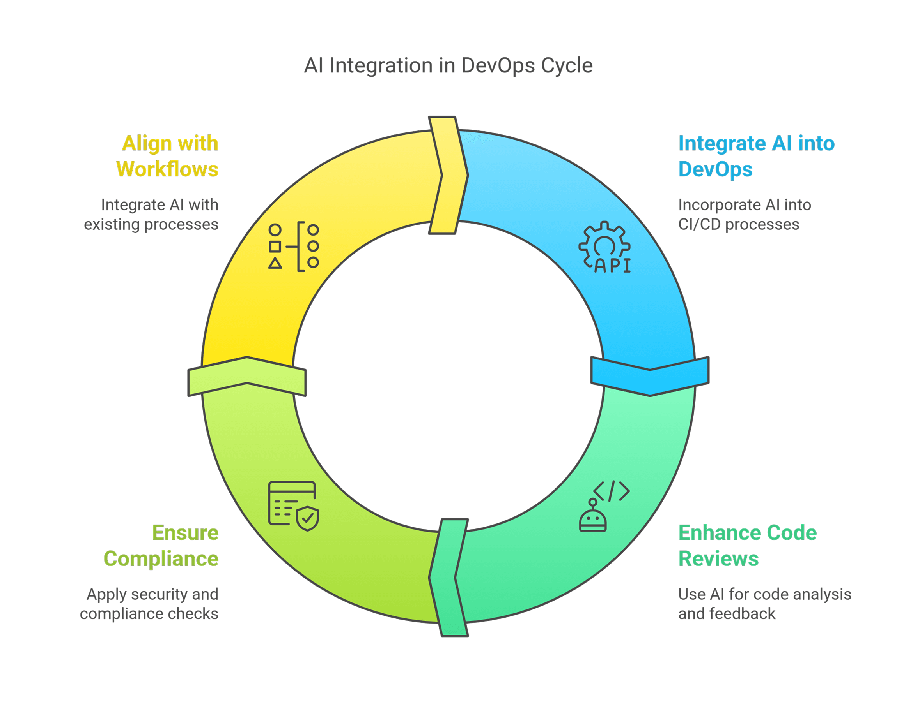

# Breaking the AI Productivity Paradox: Turning Hype into Real-World Software Development Wins

## By [Luciano Ayres](https://www.linkedin.com/in/lucianoayres/)

### First Edition | Published May 07, 2025

#### Version 1.0

## Introduction

As AI-powered development tools move from lab experiments into everyday engineering practice, many teams find themselves grappling with a familiar conundrum: despite the promise of radical speed and quality improvements, actual productivity gains often lag expectations. _Breaking the AI Productivity Paradox_ unpacks why this happens—and, more importantly, how to turn hype into tangible wins.

---

### Overview of Chapters

- [Chapter 1: The Productivity Paradox in AI Development](#chapter-1-the-productivity-paradox-in-ai-development)  
  Defines the core paradox—powerful AI assistants yet slow adoption—and outlines why promising studies don’t always translate into enterprise results.

- [Chapter 2: The New Wave of AI-Powered Development Tools](#chapter-2-the-new-wave-of-ai-powered-development-tools)  
  Maps today’s landscape, from smart autocompletion to agentic IDEs like Cursor AI and Windsurf, and explains what these tools can (and cannot) do.

- [Chapter 3: Why Productivity Gains Aren’t Guaranteed - Exploring the Paradox](#chapter-3-why-productivity-gains-arent-guaranteed---exploring-the-paradox)  
  Explores root causes—learning curves, trust issues, human resistance, workflow friction, and misguided metrics—that impede AI’s impact.

- [Chapter 4: Case Study - Navigating Initial Adoption Challenges at AlphaTech](#chapter-4-case-study---navigating-initial-adoption-challenges-at-alphatech)  
  A mid-sized enterprise’s journey with GitHub Copilot shows how training, governance, and cultural support turned early disappointment into a 15% velocity lift.

- [Chapter 5: Case Study - Embracing an AI Agent at BetaWorks](#chapter-5-case-study---embracing-an-ai-agent-at-betaworks)  
  A deep dive on agentic AI (Cursor AI, Windsurf) illustrates both the power of autonomous refactoring and the need for prompt tuning, sandboxing, and human oversight.

- [Chapter 6: Technical Strategies for Integrating AI into the Development Lifecycle](#chapter-6-technical-strategies-for-integrating-ai-into-the-development-lifecycle)  
  Practical guidance for weaving AI into each SDLC phase—planning, design, coding, testing, review, maintenance—and tooling recommendations.

- [Chapter 7: Aligning AI Tools with DevOps Pipelines and Workflows](#chapter-7-aligning-ai-tools-with-devops-pipelines-and-workflows)  
  Shows how to embed AI steps into CI/CD, code review, security checks, and compliance workflows without disrupting delivery.

- [Chapter 8: Governance and Risk Management for AI Development Tools](#chapter-8-governance-and-risk-management-for-ai-development-tools)  
  Frameworks for policies, training, oversight, and audit trails that ensure safe, responsible, and legally sound use of AI tools.

- [Chapter 9: The Human Factor - Managing Change, Skills, and Team Dynamics](#chapter-9-the-human-factor---managing-change-skills-and-team-dynamics)  
  Tactics for managing change, addressing fears, upskilling teams, adapting workflows, and keeping morale high as roles evolve.

- [Chapter 10: Measuring Productivity and ROI in the Age of AI](#chapter-10-measuring-productivity-and-roi-in-the-age-of-ai)  
  Balances “hard” metrics (release frequency, cycle time, defect rates) with “soft” metrics (developer satisfaction, adoption rates) to validate real value.

- [Chapter 11: From Pilot to Platform - Playbook for Scaling AI Adoption](#chapter-11-from-pilot-to-platform---playbook-for-scaling-ai-adoption)  
  A step-by-step playbook and maturity model to scale AI adoption across all teams, institutionalize best practices, and build a lasting capability.

- [Chapter 12: Sustaining the Advantage and Looking Ahead](#chapter-12-sustaining-the-advantage-and-looking-ahead)  
  Reflects on sustaining momentum, preparing for next-gen AI agents, and evolving the developer role toward higher-value work.

Each chapter includes actionable takeaways and real-world examples—your roadmap for turning the AI productivity paradox into a breakthrough advantage.

---

## About the Author

Luciano Ayres is a seasoned technology leader with over **20 years** of hands-on experience managing teams that develop and deliver **scalable, high-performance solutions** across global platforms. He combines a deep passion for **developer experience** with cutting-edge **AI and automation**, helping engineering teams stay in flow, eliminate toil, and unlock new levels of productivity.

As the author of [_The AI-First Team_](https://github.com/lucianoayres/the-ai-first-dev-team-book/blob/main/The_AI-First_Dev_Team_Building_AI-Driven_Software_Development_Culture.md) and [_Agentic Software Engineering for Leaders Handbook_](https://github.com/lucianoayres/agentic-software-engineering-for-leaders-handbook/blob/main/Agentic_Software_Engineering_for_Leaders_Handbook.md), Luciano brings real-world insights and practical frameworks to empower people and organizations to thrive in a **digital-first**, AI-augmented world.

Connect with him on [LinkedIn](https://www.linkedin.com/in/lucianoayres).

---

## Chapter 1: The Productivity Paradox in AI Development

In the 1980s, economist Robert Solow quipped, _“You can see the computer age everywhere but in the productivity statistics.”_ Decades later, many IT leaders feel a similar paradox with AI-powered development tools. These tools – from intelligent code assistants to autonomous coding agents – promise unprecedented productivity. Yet in practice, organizations often **do not immediately see the expected boost** in output or speed. This puzzling gap between potential and reality is what we call the **productivity paradox** of AI development tools.

**The Hype vs. The Reality:** On paper, AI coding assistants can automate boilerplate code, catch bugs early, and even generate entire modules on their own. Research studies show developers completing tasks almost _50% faster_ when using AI pair programmers. For example, one experiment found that developers with GitHub Copilot finished a coding task in nearly half the time of those without it. Similarly, Amazon’s internal trials of CodeWhisperer (an AI code assistant) saw developers **57% faster** in completing tasks on average. These numbers paint an enticing picture – who wouldn’t want their teams to double their speed or deliver in days what used to take weeks?

**Initial Disappointment:** Despite these promises, early adopters in enterprises often report mixed results. Many knowledge workers simply aren’t using AI tools consistently in their daily work. A 2023 industry survey found that while **70% of developers have tried AI coding tools, only a tiny fraction fully trust the outputs** for complex tasks. In enterprise settings, adoption rates can be low – some teams turn on an AI assistant for everyone, only to find few developers actually using it beyond trivial suggestions. The result? Little to no improvement in overall velocity, at least at first. It’s not that the technology can’t deliver; it’s that **human and process factors** are preventing the technology from realizing its potential.

**Understanding the Paradox:** This book is dedicated to understanding and overcoming that gap. Why do AI tools with such obvious potential sometimes fail to move the needle in productivity? Common patterns have emerged across organizations: Developers may resist using the tool (for reasons we’ll explore), or they use it naively and introduce new problems. Managers might push for quick ROI and inadvertently create a culture of fear or misuse. In some cases, the introduction of AI changes workflows in ways the team isn’t prepared for, causing an initial slowdown — a classic “J-curve” of adoption where productivity dips before rising. All these factors contribute to the paradox where **adding a powerful productivity tool can, ironically, slow things down or yield negligible benefits** in the short term.

**A Call to Action for IT Leaders:** As an IT leader in an enterprise-scale development organization, you likely face pressure to leverage AI for competitive advantage. The mandate is clear: _“Use AI to make our software teams more productive and innovative.”_ This book will help you do exactly that, by providing a **practical playbook** to navigate the pitfalls and truly capitalize on AI in software development. We will blend real-world case studies (the good, bad, and ugly), proven strategies for team adoption, frameworks for integrating AI into your development lifecycle, and guidance on cultural and governance issues. The goal is to equip you with a **roadmap to turn the productivity paradox into a productivity breakthrough**.

Before diving in, let’s clarify what kinds of tools we’re discussing. “AI-powered development tools” in this context primarily means **generative AI assistants for coding and software engineering tasks**. These range from code completion engines (like GitHub Copilot, Amazon CodeWhisperer, Tabnine) to more **“agentic” coding tools** that can perform multi-step development tasks autonomously (like Cursor AI and Windsurf). It also includes AI-driven testing tools, documentation generators, and AI assistants for code review and DevOps. Throughout the book, we will focus on these tools’ impact on the daily work of software teams.

**How to Use This Book:** Each chapter tackles a facet of the adoption journey, from understanding developer psychology to implementing technical integrations. We’ve included **actionable takeaways** at the end of each chapter, so you can quickly glean the steps to apply in your organization. Let’s embark on this journey to turn hype into tangible productivity, and unravel the productivity paradox once and for all.

### Key Takeaways:

- The **productivity paradox** refers to the lack of immediate productivity gains despite promising AI dev tools. Many teams see little improvement initially.
- AI coding assistants have demonstrated **huge potential** (up to 50% faster task completion in studies), but real-world adoption in enterprises often lags.
- Common scenario: New AI tools are introduced with high hopes, but developers use them sparingly or improperly, yielding **disappointing early results**.
- This book will help IT leaders understand why the paradox happens and provide a **practical roadmap** to overcome it, turning unrealized potential into actual productivity gains.

---

## Chapter 2: The New Wave of AI-Powered Development Tools

To tackle AI integration effectively, IT leaders must first grasp the landscape of AI development tools and what they can (and can’t) do. In recent years, we’ve moved beyond simple code autocomplete into a new wave of intelligent, and even **agentic, development tools**. Let’s explore this landscape, as understanding the tools is a foundation for using them productively.

**From Autocompletion to “AI Pair Programmers”:** Many developers got their first taste of AI assistance with smart autocompletion in IDEs. These early tools (think IntelliSense on steroids) could suggest the next line of code based on context. Modern AI coding assistants take this further by leveraging large language models trained on vast code corpora. GitHub Copilot, launched in 2021, popularized the idea of an _“AI pair programmer.”_ You write a comment or a function signature, and Copilot suggests entire blocks of code. It can even write simple functions from scratch based on a description. Amazon’s CodeWhisperer and others offer similar capabilities, generating code snippets or complete functions in real time as you code. Developers using these tools often describe it as _having a junior developer sitting next to them who offers suggestions_ – sometimes amazingly helpful, other times off-base.

**Capabilities to Expect:** What exactly can these AI assistants do today?

- **Code Generation:** Produce code for a given task (in dozens of languages) based on natural language prompts or existing code context.
- **Code Completion:** Finish your line or block of code intelligently, not just based on syntax but learned patterns.
- **Refactoring and Improvement:** Suggest improvements or refactor existing code for readability, performance, or style consistency.
- **Explaining Code:** Read code and explain in natural language what it does – useful for onboarding or understanding legacy code.
- **Generating Tests:** Create unit tests or test cases for given code, saving developers time in writing boilerplate test code.
- **Debugging Help:** Analyze an error or exception and suggest what might be wrong or even propose a fix.
- **Multi-modal Assistance:** Some tools integrate with chat interfaces where you can ask questions about your codebase, get architecture suggestions, or even design diagrams (for instance, asking “draw an ERD for this schema”).

It’s important to note that these capabilities greatly reduce grunt work. One developer quipped that using an AI assistant let him _“barely write any code by hand anymore”_ – mundane portions are generated, allowing him to focus on high-level logic. However, these tools are far from replacing human programmers; they often make mistakes and require guidance, which we will address in later chapters.

**Rise of Agentic Coding Tools:** The latest evolution in this space is what we call **agentic coding tools** – AI systems that don’t just respond to single prompts but can take on a more autonomous role in development tasks. Two notable examples are **Cursor AI** and **Windsurf**. Both are essentially AI-enhanced IDEs (integrated development environments) that can act with a degree of initiative.

What sets agentic tools apart is their ability to handle multi-step tasks and proactively manage context:

- **Cursor AI**: Built as a specialized AI-first code editor, Cursor introduced an _“Agent mode”_ where the AI can operate across multiple files and even execute commands. For example, in Cursor you can say, “Create a new React component for user profile and integrate it into the app,” and the AI agent will generate the component file, modify relevant existing files (like adding a route or import), and even run shell commands (perhaps to install a needed library or run the app to verify it works). This agent mode automatically figures out which files to read or modify in order to fulfill your request – saving you from manually providing each file as context.
- **Windsurf**: Another AI-augmented IDE, Windsurf pioneered a feature called “Cascade.” Cascade mode similarly lets the AI take control of context management – it can “cascade” through your project, find relevant pieces, edit multiple files, and run your test or build commands to validate changes. Essentially, Windsurf’s Cascade was the original example of letting the AI drive the IDE for you in a controlled way. Users of Windsurf often praise how it keeps them “in flow.” For instance, if you ask Windsurf to implement a feature, it might automatically open the files it deems relevant, insert code, run the tests, and report back the results – all in one seamless loop.

These agentic tools function almost like a junior developer that can execute instructions. It’s not hard to imagine their potential: a single high-level prompt could trigger hours’ worth of coding and testing work done autonomously. Early adopter developers have reported being able to generate entire small applications by iteratively instructing such an AI agent, rather than writing code line-by-line. It’s an exciting frontier, but it also introduces new challenges (e.g. ensuring the AI doesn’t go off-track and managing the scope of changes, which we’ll discuss later).

**Notable Tools and their Niches:** Aside from Cursor and Windsurf, the ecosystem includes:

- **GitHub Copilot (by Microsoft)** – A plugin to VS Code and other editors, excels at inline code suggestions. Now evolving into Copilot X with chat and CLI features.
- **Amazon CodeWhisperer** – Integrated with AWS tooling; apart from code suggestions, it uniquely offers _built-in security scanning and reference tracking_ (it can warn if a generated snippet is too similar to known open-source code, including the license info).
- **Tabnine** – An early code auto-complete AI, which runs either in cloud or on-prem, known for snappy suggestions, though not as advanced in generating large blocks of code.
- **Replit Ghostwriter** – Tied to Replit’s online IDE, also now featuring an “AI agent” that can take actions in your project and even answer questions about code.
- **OpenAI’s ChatGPT (with Code Interpreter)** – Not an IDE tool, but developers use ChatGPT’s advanced GPT-4 model in a conversational way to generate code, debug, or even run code snippets in a sandbox (Code Interpreter feature). This is often used outside the IDE, in a browser, but can then be transferred into projects.
- **Internal/Custom AI Tools** – Some large enterprises build their own AI assistants fine-tuned on their proprietary codebase or documentation. For example, companies have created chatbots that answer questions about their internal APIs, or custom code generation tools for domain-specific languages. These may not be public, but they follow the same principles.

Understanding this tool landscape helps leaders choose the right tools for their teams and anticipate their capabilities. It also underscores **why the productivity paradox is so tantalizing**: with such powerful functionality, if your team isn’t seeing at least a 20-30% improvement in output (a range cited by McKinsey for potential gains), it feels like something’s wrong. In the next chapter, we’ll delve into exactly why these gains don’t automatically materialize, no matter how advanced the tool.

### Key Takeaways:

- Modern AI development tools range from **smart autocomplete** to **AI pair programmers** that can generate substantial code from prompts.
- **Agentic coding tools** (e.g. Cursor, Windsurf) can perform multi-step coding tasks autonomously – editing multiple files and running commands – acting like a junior dev with initiative.
- Each tool has strengths: Copilot for general code suggestions, CodeWhisperer with security and license awareness, etc. Choosing a tool should fit your team’s tech stack and needs.
- The capabilities are impressive (code, explain, test, refactor, etc.), but knowing _what they can do_ is just the first step. Next, we address why having a great tool isn’t enough to guarantee productivity gains.

---

## Chapter 3: Why Productivity Gains Aren’t Guaranteed - Exploring the Paradox

If AI coding tools are so powerful, why do many teams struggle to realize their benefits? Here we examine the root causes behind the productivity paradox. By understanding these, you’ll be better prepared to address them head-on in your organization.

**The Learning Curve and Skill Gap:** Introducing an AI assistant into development isn’t a plug-and-play boost; developers need to learn _how to use it effectively_. This includes writing good prompts or query instructions, interpreting the AI’s output, and integrating suggestions into code safely. It’s a new skill set. Initially, using the AI might actually slow a developer down: they have to pause and think, “How do I ask for what I need?” or sift through an incorrect suggestion. Without proper onboarding or practice, teams often **don’t climb the learning curve** fast enough to see gains. In the meantime, they could get frustrated and revert to old-school coding. This creates an **initial productivity dip** that can look like the tool isn’t helpful, when in fact it’s a temporary learning hump.

**Trust and Quality Concerns:** Seasoned engineers are trained to not trust anything they didn’t create or verify. AI suggestions, while convenient, might be viewed with suspicion – _“Is this code correct? Secure? Optimal?”_ Often, skepticism is warranted. Early studies famously showed that AI-generated code can be buggy or insecure about **40% of the time**. While models have improved, they do make mistakes – from subtle bugs to suggestions that don’t compile. If a developer doesn’t trust the tool, they will spend extra time double-checking or will ignore its suggestions entirely, negating potential productivity gains. On the flip side, if a developer trusts the AI too much and accepts outputs blindly, they might introduce errors that take significant time to fix later (hurting productivity downstream). Striking the right balance of healthy skepticism and trust is tricky. Many teams err on one side or the other initially, limiting the tool’s net benefit.

**Fear and Resistance – The Human Factor:** Any time a new technology arrives, people worry about its impact on their roles. In the context of AI coding tools, some developers **fear that “AI will replace me.”** A Stack Overflow survey found 40% of developers feared AI could replace parts of their job. Even if they don’t fear job loss, they might worry that reliance on AI will erode their own skills or creativity. These anxieties can lead to conscious or unconscious **resistance**: for example, developers might underutilize the tool, or avoid the most powerful features, sticking to familiar manual work. In group settings, a developer might be reluctant to admit they used AI assistance, thinking it could reflect negatively on their own capability. All this means the tool doesn’t get fully embraced – it might run in the background, but the team’s habits haven’t changed. The paradox here is obvious: a tool meant to help them is viewed as a threat, so it doesn’t help them.

This fear-driven resistance can be exacerbated by management if not handled carefully. For instance, if leadership starts **tracking AI usage metrics** too early (e.g. measuring how many lines of AI-generated code each dev produces), it can create a Big Brother effect. Developers may feel they’re being monitored for replacement or judged by the tool’s output, which amplifies anxiety. One engineering director described a vicious cycle in such cases: _The company pushes AI to improve efficiency; engineers hesitate to use it fully; initial results are poor; management, seeing little improvement, doubles down with more monitoring and pressure; developers get even more afraid or demoralized, further resisting adoption._ Such dynamics derail productivity rather than enhancing it.

**Workflow Disruption and Integration Gaps:** A subtler cause of limited gains is when the AI tool doesn’t fit smoothly into the team’s established workflows. Imagine a typical development workflow in your organization – you have planning, coding, code review, testing, CI/CD pipelines, etc. If the AI assistant is only available in certain environments (say, only in a cloud IDE that not everyone uses, or it can’t be used for code review suggestions), it can become a side gadget rather than an integral part of the process. Developers might have to break their flow to use the tool – for example, copying code into a separate AI chat window to get help and then back into their project. Such context-switching costs time and interrupts concentration, potentially **reducing productivity** (contrary to the tool’s intention to keep developers “in flow”). In some cases, the AI’s suggestions might not align with the team’s coding standards or the architecture in place, creating friction that has to be manually resolved. All these small integration frictions add up, and teams might conclude “eh, it’s faster if I just do it myself” – again leaving the AI’s value on the table.

**Lack of Process and Guidelines:** Without clear guidelines or process adjustments, teams can flounder in how to incorporate the AI. For example, if there’s no agreement on “when to use the AI vs when not to,” or how to review AI-written code, confusion ensues. One developer might start generating large chunks of code with the AI, but when they open a pull request, the reviewers balk at the style or worry about licensing (because no one discussed how to handle AI contributions). The PR then goes through extra scrutiny or rework, negating any time saved in generation. In contrast, another developer might avoid using the AI for anything significant because they think it’s not allowed or not trusted. In both cases, the absence of **team norms** for AI usage means lost opportunities and inconsistent usage.

**Measurement and Unrealistic Expectations:** Lastly, how productivity is measured can distort the picture. If leadership expected a 50% boost overnight and doesn’t see it, they might label the initiative a failure prematurely. Or if they measure the wrong metrics – for instance, counting lines of code output – they might miss the real benefits or encourage counterproductive behavior (like generating lots of code that isn’t needed or is low quality). The paradox can be heightened by impatience: AI tools often require an adjustment period. If an organization isn’t seeing clear ROI in a single quarter, executives might lose faith and scale back support, never allowing time for the compound benefits to appear. In short, **impatience and mismeasurement** can kill an initiative before it flowers.

Let’s summarize the typical barriers that cause AI tools to fall short of their potential:

- **Learning Curve:** Teams need time and training to use AI effectively; productivity may dip before rising.
- **Trust Issues:** Developers either distrust AI too much (leading to underuse) or too little (leading to errors) – both hurt net productivity.
- **Fear and Resistance:** Concerns about job security or skill atrophy lead to passive or active resistance in using the tool.
- **Poor Integration:** The AI isn’t smoothly integrated into workflows (IDE, CI, code review), causing friction and context switching.
- **No Guidelines:** Lack of policies or best practices for AI usage leads to inconsistency and inefficiency (e.g., redoing AI-generated code).
- **Misguided Metrics:** Focusing on short-term or vanity metrics causes discouragement and unintended consequences, undermining the real gains.

Understanding these root causes is half the battle. The rest of this book will focus on solutions: how to address each of these issues through smart change management, process adaptation, and technical strategies. In the next chapter, we’ll start with a real-world perspective – a case study of an organization that introduced AI coding tools and the challenges they encountered, setting the stage for practical remedies.

### Key Takeaways:

- Simply adding AI tools doesn’t guarantee productivity – many teams face an **initial slowdown or negligible improvement** due to a learning curve and integration hiccups.
- **Human factors** (trust, fear, resistance) are major – developers may not fully embrace the tool at first, due to quality concerns or anxiety about job impact.
- **Workflow alignment** is crucial – if the tool doesn’t fit into existing processes or lacks clear usage guidelines, its benefits can be lost in friction.
- Management plays a role in the paradox: **unrealistic expectations or pressure** can create a vicious cycle of low adoption. Patience and measuring the right things are essential moving forward.

---

## Chapter 4: Case Study - Navigating Initial Adoption Challenges at AlphaTech

To ground our discussion, let’s look at a hypothetical (but very much reality-inspired) case study of an enterprise software organization, which we’ll call **AlphaTech**, as it introduces an AI coding assistant. This case will illustrate common challenges and set up concrete lessons.

**Background:** AlphaTech is a mid-sized enterprise developing a suite of web and mobile applications. They have about 100 developers organized into multiple teams. Quality and speed are paramount, as they release updates to their products bi-weekly. Hearing the buzz about AI in coding, AlphaTech’s CTO decides to pilot GitHub Copilot for all developers, hoping for a noticeable boost in velocity and a reduction in routine workload. They purchase enterprise licenses and integrate Copilot into the standard developer IDE setup.

**Initial Rollout:** In the first month, developers have access to Copilot in their Visual Studio Code editors. Management’s expectation is that they will see faster coding and perhaps the ability to take on more features in a sprint. To track impact, the CTO’s office starts collecting some statistics, like how many AI suggestions are accepted and whether commit frequency changes. They even consider measuring individual developers’ usage of Copilot.

**What Happened – The Reality Check:**

- **Low Early Usage:** It turned out many developers didn’t use Copilot much at first. In retro meetings, reasons emerged: Some devs felt the suggestions were “not always trustworthy” and they had to double-check everything, so they often just wrote code themselves. Others admitted they _forgot it was there_ except for trivial auto-complete cases, because they weren’t used to this style of working. A few were privately skeptical – one senior engineer said, “I’ve coded for 20 years; I don’t think I need an AI to do it for me.” Junior devs were a bit more open, but even they sometimes felt uneasy about whether using Copilot was “cheating” or if they could get in trouble for accepting code they didn’t fully understand.
- **No Noticeable Velocity Change:** After a month, management looked at metrics and saw no clear improvement in story points completed or bug counts. In fact, one team’s velocity dipped slightly. This led to concerns – the CTO had promised the CEO that AI assistance would improve output. Now the CTO was in a bind, wondering if the investment was a mistake or if the teams were just not using the tool properly.
- **Misalignment in Code Reviews:** There were instances where a developer _did_ use Copilot to generate a chunk of code (for example, some data validation logic) and submitted it in a pull request. In code review, another senior developer saw the style was different from their typical conventions and questioned its origin. When the author mentioned it was AI-suggested, the reviewer responded with skepticism: “We need to be careful; I don’t want weird AI code introducing bugs.” They ended up refactoring that piece manually. This created a subtle discouragement for the author from using AI next time.
- **Developer Sentiment:** An internal survey about Copilot usage at AlphaTech revealed mixed feelings. About 30% of respondents were enthusiastic, saying things like “It helps me with repetitive code and saves time.” Another 50% were neutral or unsure, e.g. “It’s sometimes useful, sometimes not – I haven’t figured out when to rely on it.” The remaining ~20% were negative: “I feel it disrupts my flow” or “I’m worried if I start relying on it, I won’t grow my skills.” Notably, some of the loudest resistance came from a few influential senior developers who informally advised their junior teammates to “be careful with Copilot.” This peer influence further dampened adoption.

**Management Response:** Seeing the lukewarm results, AlphaTech’s management realized that just giving people a tool wasn’t enough. The CTO called a meeting with engineering leads to discuss the roadblocks. They identified that developers weren’t clear on how best to use the tool and were concerned about quality and acceptance. In response, they took several actions:

- They arranged an **interactive training session** where an internal “AI champion” developer (who had been experimenting actively) live-demoed how he uses Copilot to speed up writing unit tests and boilerplate, emphasizing that the developer still reviews and tweaks the output. This helped others see practical use cases.
- They set some **ground rules** in a lightweight policy: for instance, “It’s okay to use AI-generated code, but you must ensure it passes all tests and meets our coding standards. Treat it like you’d treat code from an open-source library – review it before integrating.” This helped alleviate the unspoken stigma around using AI assistance.
- Management also explicitly messaged that **Copilot is a tool to augment developers, not evaluate them**. They stopped any talk of measuring individual AI usage and instead focused on team outcomes. The CTO addressed the team: “Our goal is to free up your time from drudgery to focus on creative work. We are not checking how many lines Copilot wrote for you. We care about results – quality code and features delivered. If Copilot helps you achieve that, awesome. If not, let’s figure out why together.”
- They encouraged a trial where one team would deeply integrate Copilot use in their workflow as a pilot example. This team, with supportive leadership and one of the enthusiastic devs, agreed to document how they used the tool over the next sprint and what benefits or issues they observed.

**Turning the Corner:** Over the next two months, these changes started bearing fruit. The pilot team, after some experimentation, found meaningful ways to use Copilot: they had it generate initial versions of boilerplate-heavy modules (which they then refined), and they used it during code reviews to auto-suggest improvements (one trick was copying a diff into the Copilot chat and asking for feedback, treating it like a reviewer). They reported that for certain kinds of tasks, they felt a 20-30% speed improvement. They also caught an instance where Copilot suggested a less secure implementation (using a deprecated function); thanks to their vigilance, they caught it – and they fed that lesson back as a rule for everyone: “Don’t accept suggestions involving deprecated crypto functions,” for example.

Other teams, seeing their peers have success (and not reprimanded for using AI), began to follow. The senior skeptics slowly thawed as they saw juniors still producing good quality work and not turning into “copy-paste coders.” In fact, one senior dev was surprised that a junior, with Copilot’s help, quickly wrote a complex SQL query and unit tests for a feature – a task that senior dev thought would take much longer. This started changing perceptions: the conversation shifted from _“Is AI coding good or bad?”_ to _“In what scenarios does it help us most?”_ – a much healthier framing.

By the end of the quarter, AlphaTech’s overall development velocity did show an uptick – not a dramatic doubling, but roughly 15% more story points completed compared to prior quarters, with similar or improved quality. More importantly, the teams reported **less burnout on menial tasks** and more time spent on design and creative problem-solving. Developers widely acknowledged that the AI assistant was now part of their routine toolbox, akin to how they use Stack Overflow or Google – not perfect, but very helpful.

**Lessons Learned from AlphaTech:**

1. **Adoption takes cultivation:** Simply rolling out the tool wasn’t enough; investing in training, sharing use cases, and creating a supportive culture was critical.
2. **Address fears openly:** By explicitly stating that AI was an augmentation tool and not a metric for performance evaluation, management reduced the fear factor and resistance.
3. **Set expectations**: They reframed success not as “AI will revolutionize overnight” but “we expect incremental improvement and learning.” This patience allowed the team to gradually ramp up benefits.
4. **Peer champions help:** Seeing fellow developers successfully use the tool broke down skepticism. Early wins and internal champions can accelerate broader adoption.
5. **Policy and guidelines matter:** Light governance (what’s acceptable use, how to review AI code) prevented confusion and aligned the team on how to integrate AI into existing processes.

AlphaTech’s journey reflects what many organizations experience – a rocky start that improves with deliberate change management. Next, we’ll look at another case study with a focus on agentic tools and deeper integration into workflows, to examine additional challenges and strategies.

### Key Takeaways:

- Early adoption of AI coding tools often yields **underwhelming results** without proper support – developers may ignore or misuse the tool initially.
- **Cultural resistance and skepticism** are common. It’s vital to address these through training, open dialogue, and support from leadership (not pressure or surveillance).
- Establishing **clear but flexible guidelines** for using AI (what’s allowed, how to handle AI-written code in reviews, etc.) helps teams gain confidence in integrating the tool.
- **Internal champions and pilot teams** can demonstrate value to the rest of the org. Early success stories go a long way to convert skeptics.
- Patience is key. Small improvements will accumulate; don’t expect a miracle in week one. With iterative learning, the team’s productivity and satisfaction can noticeably improve over a few months.

---

## Chapter 5: Case Study - Embracing an AI Agent at BetaWorks

Our next case study focuses on a team that pushed the frontier by using agentic AI tools (specifically Cursor AI and Windsurf) to automate more complex development workflows. **BetaWorks**, a software company building a large-scale SaaS platform, decided to experiment with these advanced AI IDEs to accelerate their development process. Their experience highlights additional challenges around letting an AI take on more autonomous tasks, as well as the integration with dev pipelines.

**Background:** BetaWorks has a forward-looking engineering culture always eager to try new developer tools. They maintain a massive codebase (hundreds of microservices) and were particularly interested in reducing the toil of maintaining and refactoring code across many services. They identified two use cases for agentic AI assistance:

1. **Large-Scale Refactoring:** e.g., rename an API or change a library usage consistently across dozens of files and services.
2. **Feature Prototyping:** have the AI create initial boilerplate for a new microservice or module based on a high-level spec.

BetaWorks selected **Cursor AI** for this trial, attracted by its “Cursor Composer” agent mode which could generate and modify multiple files, and run shell commands (like running tests) on its own. They also kept an eye on Windsurf, even comparing the two tools’ capabilities side by side.

**Trial Setup:** A small team of 5 experienced developers at BetaWorks’s R&D lab took on the challenge. They intentionally chose a non-critical subsystem of the platform for experiments – this way, any mishaps by the AI wouldn’t impact customers. They also set a rule that all AI-generated changes must pass the full test suite and a manual code review before merging, to maintain quality.

**Using the AI Agent for Refactoring:** One of the first tasks was to use Cursor’s agent to help with a refactor: deprecating an old authentication method across their services. Normally, this meant finding all usages of a certain function and updating them, plus adjusting tests – a tedious job that could take a team several days. The developer in charge prompted Cursor’s agent with a high-level instruction: _“Replace usage of AuthMethod X with AuthMethod Y across the codebase, and ensure all references and tests are updated accordingly.”_

- **Autonomous Action:** Cursor’s agent went to work. Impressively, it identified 12 files where AuthMethod X was used, edited them to use AuthMethod Y, and even updated corresponding unit tests expected values where needed. It then ran the test suite (via shell command) to see if everything passed. A few tests failed on the first run. The agent provided a summary of failures and suggested further tweaks. The developer guided it: “fix the failing tests related to authentication changes.” The agent fixed a couple of missed spots.
- **Result:** Within about an hour, Cursor’s agent had done what might have taken a full day or more manually. All tests were green. The developer still went through a manual review of the diffs, found one edge-case adjustment to add (which he did manually), and then merged the changes. This was a big win – the team was thrilled with how quickly the boring refactor got done, while the developer overseeing it could mostly sit back and validate rather than manually edit dozens of files.

**Challenges Encountered:** However, not everything was smooth:

- In another attempt, they asked the agent to implement a new small feature across a few files. The agent created the code and even some documentation, but when running the app, the feature didn’t work correctly. Debugging it was tricky because the developer hadn’t written the code themselves – they had to trace through the AI-written logic to understand it. It turned out the AI introduced a subtle bug due to a wrong assumption about an API. The lesson learned was that **AI agents can confidently generate incorrect logic**, and debugging someone (or something) else’s code can be time-consuming. After that, the team decided to constrain the agent to more structural tasks (like boilerplate and refactoring) and be more specific in prompts for complex logic.
- They also noticed that the agent sometimes made stylistic choices that didn’t match their conventions (e.g., variable naming or code organization). Because Cursor allows “project rules” files, the team started adding guidelines for the AI (like preferred naming patterns). With each run, they refined these rules to guide the agent. It was an iterative process to teach the AI their style. This overhead was unexpected – essentially, **they had to treat the AI like a junior dev who needed mentoring**. Over time, the agent’s outputs aligned better with expectations, but it showed the need for feeding domain knowledge and style guides to the AI for best results.
- Another interesting hiccup: the AI agent in Cursor could execute shell commands, which is powerful but potentially risky. During one session, it ran database migrations as part of setting up a test environment – something the dev hadn’t explicitly asked for. This raised eyebrows about **safety**. What if an AI agent accidentally runs a destructive command? BetaWorks decided to limit the commands context for the AI (Cursor’s settings allowed some control) and not allow any production database access from the environment it ran in. Essentially, they sandboxed the AI’s execution ability to be safe.

**Comparing Windsurf:** A couple of team members also tried **Windsurf** in parallel to see differences. They found Windsurf’s Cascade agent to be very user-friendly – it guided them with a cleaner UI and felt more “Apple-like” intuitive. Windsurf automatically pulled in context from relevant files without the user explicitly listing them, which they loved because it kept them in flow. One developer said using Windsurf felt like pair programming with a very proactive partner who “just takes care of the boring stuff.” However, they noted Windsurf’s model seemed a tad less powerful on very large codebases (perhaps due to context length limits at the time), and it occasionally didn’t dig as deep into the code history as Cursor did when asked complex questions. The team concluded that **both tools had strengths**: Cursor offered more fine-grained control and some deeper power features, while Windsurf provided a smoother experience and ease of use. Ultimately, for their purpose of heavy refactoring, Cursor’s ability to be explicitly directed won out, but they saw how Windsurf might be great for individual developer productivity in day-to-day feature work.

**Integration with CI/CD and Workflow:** BetaWorks also experimented with integrating the AI into their pipeline:

- They set up a **“AI code review assistant”** script in their pull request workflow. Using OpenAI's API, they had a bot comment on PRs with an AI-generated review (it would fetch the diff and ask the AI for potential issues or improvements). This was an experiment to see if it could catch things or speed up reviews. The results were mixed: sometimes the AI review bot flagged legitimate issues (like a missed null check or a possible inefficiency), earning the gratitude of the team. Other times it made irrelevant or mistaken comments that the human reviewers had to sift through. They refined the prompt for the review bot to focus on certain aspects (e.g., “only comment on security, complexity, or style consistency issues”), which improved signal-to-noise. In the end, the team found it modestly useful – not ready to replace human code review, but a nice _supplementary sanity check_ that occasionally caught things.
- For CI, they considered using the AI to automatically generate unit tests for new code. Using Windsurf’s capability, one engineer triggered the agent to write tests whenever a new file was added. This produced some basic tests which did increase coverage, but maintaining those tests (when requirements changed) was sometimes annoying, as they’d break and the AI wasn’t automatically maintaining them unless prompted. They put that idea on hold, realizing that a more managed approach (perhaps invoking AI for tests on demand rather than blindly) was better.
- In terms of security and compliance, BetaWorks’ security officer was initially concerned: _Are we letting an AI write code that might be insecure?_ They double-down on running static analysis (like OWASP scans) on all AI-generated contributions. Interestingly, when using CodeWhisperer for a comparison, they saw it flag a piece of code the AI offered as potentially similar to an open-source snippet – something neither Cursor nor Windsurf did. This impressed them about CodeWhisperer’s compliance features, though CodeWhisperer itself wasn’t as agentic. It led them to incorporate a practice: if the AI outputs a large chunk of code that looks too “clean” or familiar, do a quick check if it’s copied from somewhere. They didn’t find any direct plagiarism, but it’s a good compliance thought they documented for the future.

**Outcomes:** BetaWorks’s experiment was deemed a success in terms of learning, if not a clear-cut productivity metric win. The refactoring tasks that used to take days indeed got done in hours – a tangible improvement. For new feature development, the AI agent served as a rapid prototyper. One team member said, _“It’s like having an intern who can scaffold things super fast. I still have to go refine it, but it saves me from writing boilerplate.”_ They estimated that for tasks like writing new service templates, they achieved about a 30% time savings.

However, they also invested time in **setting up the AI (guidelines, sandboxing, prompt tuning)** and **debugging AI-made mistakes**. So the overall ROI had to account for that overhead. On net, the team felt it was beneficial, especially for large-scale maintenance tasks that everyone usually dreads. Developers also reported anecdotally that it made those refactor sprints _much less painful_ – morale boost is hard to measure, but very valuable.

Importantly, BetaWorks management saw enough promise to expand these tools to more teams, but with the lessons in mind:

- They created an internal **“AI Agent Usage Guide”** that distilled what the pilot team learned: e.g. “Use for refactoring and boilerplate, be cautious for complex logic”, “Always run full test suite and do manual code review on agent outputs”, “How to write effective prompts for multi-file changes”, and “Keep the agent sandboxed away from prod data.”
- They also started developing a **governance policy** for AI agents. Because these tools can run commands, they drafted rules like “AI tools can only operate in dev/test environments with non-sensitive data” and “Any autonomous action affecting infrastructure must be approved by a human.” This was to ensure as they scale up usage, they avoid any accidents.

BetaWorks’ journey with Cursor and Windsurf shows both the **immense power and the new challenges of agentic AI**:

- Power in that tedious multi-file tasks can be handled swiftly, and a single developer can accomplish what might have taken a whole team.
- Challenges in that the AI needs oversight, guidance, and technical safeguards to fit into a professional development environment.

This case demonstrates that with careful application, even cutting-edge AI agents can be leveraged in an enterprise context, but they require thoughtful integration into team practices and tooling.

### Key Takeaways:

- **Agentic AI tools** like Cursor and Windsurf can dramatically speed up large-scale code changes and boilerplate generation, acting autonomously to edit code and run tests.
- Treat AI agents as you would a new team member: they need **guidance (prompts, rules)** and produce better results with coaching and constraints. Invest time in setting style guides or rules for the AI.
- Always maintain **human oversight**. AI-driven changes should go through tests and code review. This catches logical mistakes and ensures quality remains high.
- **Sandboxing and safety** are crucial when AI can execute commands. Restrict the AI’s environment to avoid any unintended destructive actions.
- When integrated thoughtfully (e.g., in code reviews or CI for specific tasks), AI can augment the dev workflow – but expect some trial and error. Document and share the best practices as they emerge to scale the usage across teams.

---

## Chapter 6: Technical Strategies for Integrating AI into the Development Lifecycle

With an understanding of the challenges and possibilities from the case studies, we now turn to practical strategies for integrating AI tools into your software development lifecycle (SDLC). Successful adoption isn’t just about installing a browser plugin – it involves weaving the tool into each phase of development where it provides value, and adjusting processes accordingly. Let’s walk through the SDLC stages and discuss how AI can be embedded in each, along with the technical frameworks or tools that can facilitate this integration.

**1. Requirements and Planning Phase:** AI can contribute even before coding begins.

- _User Story Generation:_ Product managers or business analysts can use large language models (like ChatGPT) to draft user stories or feature requirements from high-level ideas. For example, given a description of a feature, the AI can outline possible user stories or acceptance criteria. This can accelerate the planning workshops by providing a starting point for discussion (the team will still refine and validate them).
- _Backlog Grooming Assistants:_ Some organizations have experimented with AI tools integrated in Jira or other planning tools. An AI could analyze past similar tickets and suggest estimates or point out potential dependencies for new backlog items. While this is experimental, it hints at AI helping in estimation and impact analysis.
- _Architecture Brainstorming:_ Early in design, developers can ask AI to propose high-level designs or component diagrams. While an AI won’t fully design your system, it can enumerate possible approaches (e.g., “What are some ways to design a multi-tenant authentication module?”) which architects can then evaluate. This can surface ideas or even diagrams (tools like Diagrams.net coupled with AI can generate rough UML diagrams from text descriptions).

**2. Design and Prototyping Phase:** Once requirements are known, teams move to design. Here, AI’s knowledge base can be a powerful aid.

- _Technology Research:_ If you’re exploring a new technology or library, AI can quickly summarize its usage. Developers might ask, “How do people usually implement OAuth2 in a Node.js API?” and get a step-by-step or code snippet answer. This accelerates the design of integrations.
- _Schema and Model Design:_ AI tools can generate initial database schemas or data models if given descriptions. For instance, describing entities and relationships to an AI might yield a draft schema (which the dev team can adjust). It’s like having a sounding board that drafts something tangible to iterate on.
- _API Design:_ You can ask AI to draft an API spec (in OpenAPI format or similar) given the requirements of a service. It might not be perfect, but it can produce an outline of endpoints and request/response shapes, saving time in writing boilerplate API definitions.
- _Functional Prototypes:_ This is where agentic tools shine. During design, a developer can create a quick proof-of-concept by saying, “Hey AI, build a simple prototype of Feature X with these constraints.” Tools like Cursor or even Copilot in a sandbox can stub out a basic working model. For example, generating a simple web form and backend logic to test an idea. This throwaway prototype can validate an approach in hours instead of days.

**3. Implementation (Coding) Phase:** This is the core – where AI assists developers in writing the actual code.

- _In-IDE Pair Programming:_ Encourage developers to use the AI assistant **continuously as they code**. This could mean writing a comment like “// TODO: parse the CSV file and handle errors” and letting the AI generate the code for it, which the developer then reviews and adapts. The key is making it a part of the inner development loop, not something you only invoke sporadically.
- _Multi-file Coordination:_ For tasks that touch many files, plan how to use the AI systematically. For example, if adding a new field that propagates through multiple layers (database, API, UI), consider letting the AI do each layer guided by prompts. Some advanced frameworks might let you do this in one prompt (as BetaWorks did with Cursor’s agent). If not, you can still use the AI step by step: generate the model change, then the API change, then the UI change. Frameworks or scripts can orchestrate this – for instance, a custom CLI tool that feeds context to an AI for each step. This requires some development to set up, but a forward-thinking team could build an “AI augmentor script” that knows about their project structure.
- _Coding Frameworks with AI Integration:_ There are emerging frameworks where AI integration is baked in. For example, some low-code platforms and internal dev frameworks allow comments like `@[AI: implement sorting here]` which an AI service will fulfill. These are not mainstream yet, but keep an eye out for development tools that allow inline AI triggers. Until then, using the AI through the IDE or a chat window side-by-side works.
- _Pairing AI with Templates:_ If your organization has standard templates (like a service template or a module skeleton), you can combine those with AI. A possible approach: have a script that generates the basic template, and then have the AI fill in specific parts. For instance, generate a new microservice from template, then prompt AI to implement the core logic inside it. This hybrid approach ensures structure (from templates) plus content (from AI).

**4. Testing Phase:** Quality assurance is critical, and AI can help here too.

- _Test Case Generation:_ For each new feature or module, ask the AI to suggest test cases. For example, “Given this function (with code), generate a set of unit tests covering edge cases.” The AI can create tests which developers can then run and verify. This often increases test coverage with minimal effort. Tools like Copilot can even automatically suggest tests as you write code (if you write a test file, it may fill out test scenarios).
- _Automated Testing Scripts:_ Some QA engineers are using AI to write end-to-end test scripts (e.g., Selenium or Cypress tests for web apps). Provide a description of user flows and let AI draft the test automation code. It may not perfectly handle sync issues or selectors every time, but it gives a big head start.
- _Test Data Generation:_ Need a large set of realistic test data? AI can generate sample data that follows patterns (like a JSON of dummy user profiles, transactions, etc.) which can be used in testing environments.
- _Bug Diagnosis:_ When a test fails or a bug is reported, an AI assistant can help sift through logs or error messages. Developers can copy an error stack trace into an AI chat and ask for likely causes. Or even ask, “What changed in this function could cause it to fail this test?” if they feed in the context. It’s like having a rubber duck debugger that actually responds with ideas. While the AI might not always pinpoint the bug, it often can explain what the error means or suggest areas to check.

**5. Code Review and Collaboration:** Integrating AI into the peer review process and team collaboration can enhance quality.

- _AI-assisted Code Reviews:_ As seen in BetaWorks, an AI can act as an additional reviewer. Practically, you could integrate a GitHub Action (or similar in GitLab, etc.) that runs an AI on the diff and posts comments. If doing this, tune it to your needs to avoid noise. Another lighter method is for the human reviewer themselves to use AI: If a reviewer sees a piece of code and isn’t sure if it’s optimal, they might quickly ask the AI “Is there a better way to do X in this code?” and see if it suggests an alternative. This can augment the reviewer’s own knowledge, like a quick on-the-fly consultation.
- _Documentation and Commenting:_ Encourage developers to use AI to document code as they write or review it. For instance, after implementing a complex method, a dev could prompt the AI, “Generate a clear docstring/comment for this function.” This often yields a nice explanation which the dev can tweak. It lowers the friction to writing documentation. Some teams even use AI to create initial drafts of architecture docs or README files for new components, which devs then refine for accuracy.
- _ChatOps with AI:_ Teams using chat platforms (Slack, Teams) can integrate an AI bot to assist during development discussions. For example, someone can tag the bot with a question like “@AIbot how do I serialize this object in Python?” and the bot answers right in the chat. This keeps knowledge flow inside team communications rather than context switching to a browser. It’s a way to collectively leverage AI help. Many companies have created such internal AI bots by connecting OpenAI or other APIs to their Slack.
- _Knowledge Management:_ AI can help in summarizing and indexing project knowledge. One idea is feeding your commit history or design discussions into an AI-indexable format, so developers can query, “Why did we choose technology X for this service?” and the AI (armed with your documentation) can answer from past records. This is advanced and needs careful setup (basically creating an internal knowledge base with an AI interface), but some forward-thinking teams do this to avoid “institutional memory loss.”

**6. Deployment & Maintenance Phase:** Post-release, AI still can play a role.

- _CI/CD Integration:_ Use AI to analyze build or deployment failures. If a deployment pipeline fails, you could automatically feed the logs to an AI and have it annotate likely causes. For instance, if a container fails to start due to a config error, the AI might detect “Error X usually means the config file is missing Y field.” This can save devs time in troubleshooting CI/CD issues.
- _Performance Monitoring & Optimization:_ AIOps is a growing field where AI analyzes system logs and performance metrics to detect anomalies. While not coding assistance per se, it's adjacent – AI can alert the dev team that “the latest deployment caused memory usage to spike, possibly due to [analysis of new code].” Some monitoring tools are adding such AI-driven insights. Developers can then use AI to get ideas on fixing, e.g., “My app’s memory usage increased after using library Z, how to optimize?” and get suggestions.
- _Continuous Improvement Loops:_ After deploying, teams often do retrospectives or gather user feedback. AI can help summarize feedback from support tickets or reviews related to the latest release, highlighting areas of the code that might need attention. This can indirectly inform where devs should focus maintenance or refactoring efforts.
- _Legacy Code Maintenance:_ For older parts of the system, new team members can use AI to understand code. They might ask, “Explain what this 10-year-old module does.” The AI’s explanation (based on reading the code) can accelerate the understanding phase, making maintenance less daunting. Also, if you plan to modernize that legacy code, you can have AI suggest modernization approaches or even attempt to refactor small pieces (with heavy oversight, as legacy can be tricky).

Throughout these stages, one principle is clear: **embed the AI where it naturally fits into developer activities.** If developers have to constantly step out of their flow to use the AI, consider bringing the AI into their flow (via IDE integration, chatbots in their communication channels, etc.).

From a tooling perspective, ensure your environment is set up to allow easy AI access:

- Use IDE plugins (VS Code, IntelliJ, etc. have plugins for Copilot, CodeWhisperer, Tabnine, Cursor, etc.).
- If security policies prevent internet tools, consider deploying on-premise AI models (there are open-source code models like StarCoder, Code-Llama that can run internally). This can be part of your technical strategy if data privacy is a concern – we’ll cover governance later.
- Provide enough computing resources if using powerful AI (some require good internet or GPU support). For example, running an AI that indexes your whole code repo might need a beefy server – allocate that in your infra plans.

Finally, treat the integration as an **iterative process**. Start with high-impact, low-risk areas (like test generation or documentation where if the AI is wrong, the cost is low). As confidence grows, expand to more critical path areas (like core code generation, architectural suggestions). Gather feedback from developers on where the AI helps or hinders, and refine accordingly.

### Key Takeaways:

- Integrate AI assistance at **every stage of the SDLC** where it provides value – from requirements (story drafting) to design (prototypes, diagrams) to coding (in-IDE suggestions) to testing (auto-generating tests) to code review (AI recommendations) and maintenance (troubleshooting help).
- Use the right **integration points and tools**: IDE plugins, chatbots in team communication, and possibly custom scripts to feed AI context (like PR diffs or logs) so the AI can assist where needed.
- Aim to keep developers “in flow” – bring AI into their existing tools and processes rather than forcing awkward context switches.
- Start with simple integrations and **expand gradually**. For instance, begin by using AI for unit tests and comments, then move into heavier codegen and refactoring once the team is comfortable and trust is established.

---

## Chapter 7: Aligning AI Tools with DevOps Pipelines and Workflows

One of the keys to overcoming the productivity paradox is ensuring AI tools don’t sit on an island, but rather mesh with your **CI/CD, code review, security, and compliance processes**. In this chapter, we delve into how to align AI integration with these critical software delivery pipelines and workflows, so that AI becomes a seamless part of delivering quality software.

**Continuous Integration (CI) Alignment:** In modern DevOps, every code change triggers automated builds and tests. How do AI tools fit in without breaking this rhythm?

- **Automate the AI in CI:** Some progressive teams incorporate AI steps in their CI pipeline. For instance, after all tests pass, you might have an AI step that generates a release note draft based on commit messages or even suggests additional tests if coverage is low. Another idea: if a build fails, automatically invoke an AI to analyze the logs and attach an “AI diagnosis” to the failure report. This saves developers time parsing logs. It’s important that these AI steps are non-blocking (i.e., they don’t cause the pipeline to fail if the AI has an issue, and they run in parallel or after main checks).
- **Pre-commit Hooks:** On dev machines, you could have Git hooks that use AI to lint or analyze code. For example, a pre-commit hook that runs an AI-based security scan on the diff and warns the developer if something looks fishy (like usage of an insecure function). This requires an AI model or service accessible at commit time – which might be too slow for every commit, but can be configured for certain file types or large changes.
- **Artifact Validation:** When building artifacts (like container images), AI could be used to verify configurations. For example, scanning Dockerfile with an AI to ensure best practices (are you installing only necessary packages? Are secrets being handled properly?). Traditional linters do this too, but an AI might catch less black-and-white issues or give suggestions in plain language.

**Continuous Delivery/Deployment (CD) Alignment:** Once code is integrated, it goes to deployment. While deployment is usually more about automation scripts, AI can assist in verifying the readiness and compliance of code before it goes live.

- **Policy Enforcement with AI:** Suppose your company has a policy that no API endpoint should be released without documentation. An AI could check the code changes to see if new endpoints have accompanying docs or comments. If not, it could flag this or even generate a draft documentation for those endpoints that gets attached for a tech writer to review. This ensures compliance with internal standards in an automated way.
- **Canary and Monitoring Checks:** After deployment, AI-driven anomaly detection might catch issues faster (as mentioned, AIOps). For example, if an AI notices that right after deploying a new version, user errors increased, it could roll back or alert automatically, linking it to the code change likely responsible. This is an emerging area but aligning AI with deployment monitoring can shorten the feedback loop (thus indirectly boosting productivity by reducing firefighting time).

**Code Review Process Integration:** Code review is a workflow that ensures code quality and share knowledge. Here’s how AI fits:

- **AI as a Reviewer (with Caution):** We discussed having an AI bot comment on pull requests. If implementing, it’s wise to **tune the AI and build trust**. Initially, treat its comments as suggestions and always have a human make the final call. Over time, if it proves accurate in certain domains (say, it’s really good at spotting missing null checks or style inconsistencies), you might even set some conditions like “if AI flags a critical security issue, block merge until addressed.” But give it time to earn that level of trust.
- **Developer Workflow Adjustment:** Encourage developers to self-review with AI before assigning to peers. For example, a dev could generate an AI report on their own PR and fix obvious things the AI points out (like simple bugs or style issues) _before_ their colleagues even see it. This makes human reviews more focused on design and complex logic rather than nitpicks, accelerating the overall review cycle.
- **Knowledge Sharing:** If the AI suggests an alternative approach in review, whether accepted or not, it’s an opportunity for team discussion. Sometimes it might propose using a different library or pattern. Use this to trigger healthy engineering debates in the review: “The AI suggested using approach X here. Do we agree or prefer our way? Why?” It can surface questions that lead to clarifying team standards or educating junior devs. In this way, AI integration can actually enhance collaborative learning.

**Security Workflow Alignment:** Security and compliance are top concerns in enterprises, and an AI that writes code must operate within those guardrails.

- **Secure Coding Guidelines for AI:** Just as you have secure coding guidelines for humans, define them for AI usage. For example: “Do not use deprecated encryption algorithms. Avoid hardcoding secrets or credentials.” Many AI models may not inherently know your security policies, so developers need to enforce them. If an AI suggestion violates a guideline, it should be rejected. One strategy is to encode these rules into the AI prompt (e.g., “Follow OWASP best practices” or “Our code style forbids using MD5 for hashing”), or more reliably, use a static analysis after code is written. Modern AI-integrated development tools might soon allow attaching these policies as constraints the AI must follow – keep an eye out for that capability.
- **Security Scanning Integration:** Tools like CodeWhisperer have built-in security scanning. If you use such a tool, integrate its output into your security workflow. For instance, if CodeWhisperer flags a vulnerability in generated code, treat it like a finding from any security scan – log it, address it, and learn from it. For tools without such features, ensure your usual security scans (SAST, DAST) are run on AI-produced code just like human code. Maybe even run them more frequently if AI is generating a lot of new code quickly.
- **Dependency and License Compliance:** AI might introduce new dependencies (e.g., it suggests using a library you didn’t plan on). Have your CI process check that any new library passes your security and licensing checks. If your company disallows certain licenses (GPL, etc.) or unvetted packages, this needs to catch AI-suggested additions. Ideally, developers should prompt the AI to use approved libraries (e.g., “Use our internal util library for JSON parsing” in the prompt), but if they don’t, the pipeline should catch any non-compliant additions before they reach production.

**Compliance and Audit Trail:** In regulated industries, you might need to audit how code was produced or reviewed.

- **Tagging AI Contributions:** Some companies have considered tagging commits or code comments that were AI-generated (for example, adding a comment “// Generated by AI tool X, needs review”). This can help later if an issue arises, to trace back if a particular piece was AI-written and perhaps needed more scrutiny. It might also be useful for accountability – not to blame the AI (the team owns the code regardless), but to analyze effectiveness or patterns (e.g., “80% of our AI-written code deals with tests” – interesting insight).
- **Approval Workflows:** If an AI generates a significant piece of code (say a whole module), you might require an additional approval step by a senior engineer or architect in the review process. This isn’t much different from if a junior developer wrote it, but being explicit can ensure nothing sneaks in unchecked. For example, a rule: “AI-written code over 100 lines must get security team sign-off.” That might be overkill in most cases, but highly sensitive projects might enforce it initially until trust in the process is built.

**DevOps Maturity with AI:** Aligning AI with pipelines is part of evolving your DevOps practice:

- Some organizations are moving toward **“NoOps”** or very high automation in ops. AI can further that by automating the creation of ops scripts or infra as code. For instance, describing the infrastructure changes needed and having AI draft a Terraform script. This draft then goes through the same infra code review and pipeline. This way, even Ops workflows (CI/CD for infrastructure) can leverage AI for speed, while still using human checks for safety.
- **Rollback Strategies:** Recognize that AI might introduce unforeseen issues, so ensure your DevOps has solid rollback mechanisms. If an AI-assisted change causes havoc, you want to revert quickly. This is just good DevOps, but worth emphasizing in context of AI: do not deploy AI-generated code without the same (or greater) level of fallback readiness as normal code.

By aligning AI with your pipelines, you ensure that using AI doesn’t become a side experiment but part of the main production machine. It reduces the risk that AI usage will bypass controls or create new silos. Instead, AI becomes another component in your toolchain that works in concert with continuous integration, delivery, and quality assurance.

### Key Takeaways:

- Make AI a **first-class citizen in your DevOps pipeline**: integrate it into CI/CD processes where it can add value (automated analysis, test generation, etc.) without slowing the pipeline.
- Use AI to **enhance code reviews and QA**, but keep human oversight. Over time, fine-tune how much to trust AI-generated checks and feedback.
- Ensure AI usage **adheres to security and compliance standards**: apply the same checks (licensing, vulnerability scans) to AI output, and consider extra safeguards (like sandboxing tools or tagging AI-generated code for visibility).
- By aligning AI with existing workflows, you prevent it from becoming a rogue element. Instead, it strengthens your DevOps, catching issues earlier and automating tedious aspects of quality control, ultimately accelerating delivery in a safe manner.

---

## Chapter 8: Governance and Risk Management for AI Development Tools

Implementing AI in software development at scale requires strong governance to mitigate risks and ensure responsible use. In this chapter, we cover how to establish governance models and practices that address concerns like code quality, security, ethics, and compliance. A well-thought-out governance approach not only protects your organization, but also builds confidence among developers and stakeholders that the AI can be trusted as part of the development process.

**Why Governance Matters:** We’ve seen that AI tools can generate faulty code, introduce license or security issues, and raise accountability questions. Without guidelines and oversight, teams might misuse the tools or run into problems that erode trust and productivity. Governance provides the framework to use AI **safely and effectively**. It’s not about bureaucracy; it’s about enabling innovation _with_ guardrails.

**Key Components of an AI-in-Dev Governance Model:**

1. **Policy and Guidelines:** Documented policies on how AI tools should and shouldn’t be used. This should cover:

   - **Acceptable Use:** Define for what tasks AI assistance is encouraged vs. off-limits. For example, “AI may be used for code suggestions, test writing, documentation. AI should not be used to generate production cryptographic code without security review.” Another example: in a highly regulated codebase, you might forbid AI use in certain critical modules or require extra approvals.
   - **Data Handling:** If using cloud AI services, outline what code/data can or cannot be submitted to the AI. Many companies prohibit feeding any sensitive customer data or proprietary algorithms into external AI services to avoid leaks. The policy might require using only scrubbed or abstracted data in prompts. If self-hosting the AI, this is less of an issue, but you still might set rules like “don’t share code snippets from our codebase with public AI forums” etc.
   - **Code Ownership and License:** Clarify that all AI-generated code, once integrated, is treated as project code under the project’s license and ownership. Also caution that developers should verify any large snippet the AI provides isn’t a verbatim copy from an external source that could introduce license conflicts (in practice, the AI usually provides original synthesis, but as noted, CodeWhisperer’s approach to flagging similarities is one way to handle this proactively).
   - **Quality Assurance:** State the expectation that all AI-generated code must be reviewed and tested just like human-written code. Possibly mandate additional steps if needed (e.g., security team review if above threshold as mentioned in previous chapter).
   - **Ethical Use:** If relevant, mention that AI should not be used to generate code that violates ethical or legal standards (for instance, you wouldn’t use it to try to create malware or something – obvious, but in some contexts, specify compliance with ethics).
   - **Responsibility:** Make it clear that the **team is responsible** for AI-produced code – “the AI wrote it” is not an excuse for a bug. This frames the mindset that AI is a tool, and humans are accountable for the final output.

2. **Training and Certification:** As part of governance, consider a training program for developers on AI tool usage. This could even be a lightweight “certification” where developers show they understand the policies and best practices. For example, a short course or workshop that covers how to prompt effectively, common pitfalls, and the company’s AI use policy. Developers could have to attend this before they get access to certain AI tools in the enterprise. This ensures a baseline of knowledge and signals that using the AI is a skill to be learned, not magic.

   - Some organizations might do periodic refreshers or share newsletters on “AI tips and policy updates” to keep everyone aligned, since the AI tools and policies may evolve.
   - Training should also extend to other stakeholders: ensure that security teams, legal, and product owners understand how AI is used in dev. This cross-functional understanding helps avoid knee-jerk reactions (“You let a robot write our code?!”) by demonstrating that it’s governed and beneficial.

3. **AI Champion or Center of Excellence:** It often helps to designate specific individuals or a group as the go-to resources for AI governance. For example, an **“AI Center of Excellence”** or simply an AI steering committee within engineering. Their role might include:

   - Evaluating and approving new AI tools (so every team doesn’t adopt a different tool without oversight).
   - Monitoring usage and gathering feedback (to update policies or address issues).
   - Keeping up with external developments (new model versions, new risks disclosed) and updating the org’s practices accordingly.
   - Possibly performing audits or spot checks on code to see how AI is being used and if the quality standards are met.
   - Creating internal tools or improvements (like improving prompt templates or integrating new safety features).
   - This group essentially governs the evolution of AI usage in the company and can tweak guidelines as both the AI and the teams mature.

4. **Risk Assessment and Mitigation Processes:** Before rolling AI tools out, do a risk assessment. Identify what could go wrong: leaking sensitive info to a third-party model, AI introducing a security hole, developers becoming overly reliant and not maintaining skill, etc. Then plan mitigations for each:

   - For data leakage: use on-prem models or choose services with strong privacy assurances, and educate devs on not sharing secrets.
   - For security holes: use additional static analysis and have security team closely review initial AI-involved changes until comfortable.
   - For skill atrophy: ensure developers still rotate into tasks where they might code without AI to keep sharp, or solve problems from first principles periodically. (Some companies actually worry that juniors might not learn basics if they just accept AI suggestions – one countermeasure is still having coding drills or code review practices that force understanding).
   - Document these risks and mitigations as part of governance so leadership knows you’ve thought it through and teams know to be mindful.

5. **Monitoring and Metrics under Governance:** We discussed earlier not to misuse metrics. However, under governance, some monitoring is valuable:

   - Track overall AI adoption (e.g., how many pull requests have AI generated code? How many suggestions accepted per week?). Do this in aggregate, not per person, to gauge if usage is increasing and where bottlenecks are.
   - Monitor outcomes: Are we seeing any increase in bugs correlated with AI usage? For instance, if modules heavily assisted by AI have more post-release fixes, that’s a red flag to address via training or policy.
   - Solicit regular feedback from developers: e.g., a monthly survey or an “AI tool” Slack channel where folks can voice concerns or propose changes. Governance should be responsive to this – if devs say the AI suggests outdated libraries often, maybe update the prompt or get a better model.
   - If any serious incident occurs (say an AI-introduced bug caused a production outage or a snippet raised a licensing question), conduct a **post-mortem** as you would for any incident. Analyze how the AI usage contributed and update policies or processes to prevent a repeat (just like you do with system outages).

6. **Tools for Governance:** There are emerging tools to help with governance of AI usage:
   - Some IDEs or AI platforms allow enterprise admin controls – e.g., an admin can turn off certain features or enforce that all prompts & responses are logged (for compliance). Decide if you need to log AI interactions. Logging could help in audits (imagine being able to see what prompt led to a particular code generation if you ever needed to investigate). If you do log, be transparent with developers about it – it’s for trust and improvement, not spying.
   - Use the features of the AI tool: e.g., OpenAI offers an API with options to not save data and to set a system message with rules for the model. Utilize those to encode some governance (like a system message: “The code suggestions must follow XYZ standard” can act as a first line of defense).
   - If you have proprietary models, you can fine-tune them on your codebase and also on your coding standards. That essentially bakes governance (style, typical patterns) into the model itself to some extent.

**Handling Intellectual Property (IP) Concerns:** A governance topic worth highlighting is IP. With AI generating code, some worry: who owns that code? Could it inadvertently plagiarize someone else’s code?

- By policy, make it clear that any code written for the company (AI-assisted or not) is company IP as per employment contract. Most developer contracts cover this, but re-state it for AI to avoid confusion.
- Instruct that if an AI ever produces a big chunk that looks too specific (like a famous algorithm implementation) and the dev is unsure if it’s original, they should treat it carefully – maybe search the internet for that snippet. If it’s found to match licensed code, don’t use it. (This is rare but not impossible – early Copilot had cases of regurgitating known code for very specific prompts).
- Legal teams in some companies have guidelines: e.g., “AI output can be used freely if it’s below X characters or sufficiently transformed.” Microsoft for example indemnifies Copilot for its customers (i.e., they will handle legal issues if Copilot outputs copyrighted code unexpectedly). Knowing these details can inform your stance. If using such a service, leverage that indemnity, but still aim to avoid blatant copying via the tool.
- Keep an eye on evolving legal frameworks. The laws around AI and copyright are still forming. Your governance should adapt if, say, regulations come that require documenting AI involvement in code for audit purposes. Being proactive here will save future headaches.

**Accountability and Ethics Board (if needed):** In large enterprises or those in sensitive sectors (finance, healthcare, defense), you might establish an oversight board that includes not just engineering, but also compliance, legal, and ethics officers to periodically review AI usage in development. They can ensure it aligns with broader company values and regulations. This is more relevant if AI is making decisions with ethical weight (like AI in hiring or in product features). In coding, the ethical side might be less pronounced, but could include things like: making sure AI isn’t introducing bias (imagine AI generating biased dataset samples or something – edge case, but consider what’s relevant in your context).

In summary, governance provides the **rules of the road** for AI in coding:

- It reassures stakeholders that there’s control and thought behind the adoption (which can be important when reporting to execs or auditors).
- It guides developers so they feel safe using the tool within clear boundaries (removing fear of “am I allowed to do this?”).
- And it sets up a mechanism to continually refine the balance of innovation and control as the technology and team evolve.

### Key Takeaways:

- Establish clear **policies and guidelines** on AI tool usage – what’s allowed, what isn’t, and the responsibilities of developers when using AI.
- Treat AI adoption as a program with **governance structure**: possibly appoint an AI champion or committee, conduct training for users, and do risk assessments.
- **Mitigate risks** proactively: address data privacy (don’t feed secrets to the AI), security (review AI code thoroughly), and IP concerns (ensure compliance with licenses and ownership of AI-generated code).
- Governance is not to stifle use but to **enable safe use**. By having rules and oversight, you actually give teams confidence to use AI more fully, knowing that guardrails are in place.
- Continuously **monitor and update** governance as needed. As both the tools and team proficiency evolve, adjust policies to be either tighter (if a new risk is found) or looser (if initial precautions proved unnecessary).

---

## Chapter 9: The Human Factor - Managing Change, Skills, and Team Dynamics

At the heart of the productivity paradox is a human story. No matter how advanced the AI tools are, it’s the people using them who ultimately determine success. This chapter focuses on the human side: how to manage change and cultural shifts, how to address developers’ concerns and upskill them, and how team workflows and roles may evolve in an AI-assisted development environment.

**Addressing Developer Concerns and Resistance:** Developers are problem solvers by nature, but they also take pride in their craft. Introducing AI can unsettle some, prompting reactions ranging from excitement to anxiety. As a leader, **empathize and engage** with these emotions.

- **Open Dialogues:** Create forums for developers to voice their concerns or skepticism. This could be in team meetings, an internal discussion board, or one-on-one conversations. Listen actively. Sometimes just being heard reduces resistance. You might hear worries like “Will this make my job redundant?”, “Is relying on AI ‘real’ coding?”, or “What if I become deskilled?” Acknowledge these are valid questions.
- **Reframe AI as Augmentation:** Consistently communicate that the AI tool is there to **assist, not replace**. Use analogies: for example, say _“AI is like the power tools in a workshop. It can cut wood faster than a hand saw, but the carpenter still guides it and does the fine work. You’re the carpenter – your expertise is still critical.”_ By framing it as giving developers superpowers rather than taking away their work, you help alleviate the zero-sum thinking.
- **Job Security Assurance:** If possible, give explicit assurance that no one’s job is being eliminated due to AI adoption. Highlight that the goal is to handle growing workload or achieve things faster, not to reduce headcount. Many devs fear that showing high productivity with AI will lead management to think they can cut staff. Counteract this by focusing on how you plan to use gained capacity (e.g., “If we save 20% of our time, that means 20% more time to build new cool features or tackle tech debt that we never got to – not 20% of people fired.”).
- **Share Success Stories:** From both outside and within the organization, share stories of developers who have benefited from AI. For example, “Alice from Team X was able to finish a prototype in 2 days instead of 5 thanks to the AI help – and she said it allowed her to spend more time tuning the design instead of wrestling with boilerplate.” When peers see others have positive experiences, it reduces fear of the unknown.
- **Lead by Example:** If you’re an engineering leader with coding background, try using the tool yourself on a small project or task and share your experience honestly. Even better, have respected senior developers (influencers in the team) showcase how they use the AI. If the team’s “rockstars” endorse it as helpful, that legitimizes the tool in the eyes of others. Conversely, if your rockstars are skeptical, involve them in improving the adoption (maybe even building internal tools around it), so they feel ownership rather than opposition.

**Upskilling and New Skills Development:** AI tools introduce new skills to be learned: prompt engineering, quick validation of AI output, and even knowing when not to use the AI. Supporting developers in gaining these skills is crucial.

- **Training Workshops:** As part of onboarding to the tool (as mentioned in governance and training), conduct hands-on workshops. These should be interactive – e.g., a coding kata session where developers pair up and solve problems with the AI, then discuss what worked or not. Encourage sharing of tips (“I found phrasing the prompt like this got a better answer”, “If you include the error message in the prompt, the AI debugs better,” etc.). This not only spreads effective techniques but also normalizes using the AI in a collaborative way.
- **Pair Programming with AI:** A fun exercise is to do a traditional pair programming session but consider the AI a third partner. One developer writes, the other reviews, and they both discuss AI suggestions. This can simulate how to incorporate AI in team collaboration. It may also reveal to each other insights about how they each use the tool. Over time, developers start to internalize where AI helps the most and where their own intuition is better.
- **Prompt Crafting as a Skill:** Emphasize that writing a clear query to the AI is an important skill. Perhaps create a cheat sheet of useful prompt patterns for your codebase. Example patterns: “Implement X using Y library”, “Find bug in the following code”, “Optimize this code for speed”, etc. Encourage devs to experiment and even keep a personal list of prompts that worked well for them. This is analogous to knowing good search queries for Google or knowing stackoverflow references – it’s part of the modern developer toolkit.
- **Reading AI Code Critically:** Teach developers to read AI-generated code critically. For juniors, this is vital: they should not assume the AI is always right. Possibly incorporate this into code review training: when reviewing code (AI or human), what questions to ask? For instance, “Do I understand this code? Does it fit our design? Could it be simplified?” If a junior doesn’t understand an AI-suggested code snippet, they shouldn’t just accept it – they should use that as a trigger to learn or adjust it. Mentors can help juniors go through AI outputs to ensure comprehension.
- **Continuous Learning Culture:** The world of AI in dev is evolving fast. Encourage a culture where the team continuously learns and shares updates. Maybe in monthly engineering meetings, have a 5-minute segment, “AI tool tip of the month” or a show-and-tell of something new someone discovered. This keeps skills improving over time rather than stagnating.

**Team Workflow and Role Adjustments:** With AI in the mix, some team practices might evolve:

- **Code Reviews Focus Shift:** As mentioned earlier, human reviewers might spend less time on trivial issues (since AI can handle formatting, simple bugs, etc.) and more on architectural considerations. Make sure your review guidelines adapt: explicitly tell reviewers it’s okay to trust certain automated fixes so they can focus elsewhere. This may make the review process faster and less adversarial (nobody gets nitpicked on a forgotten semicolon if AI already fixed it).
- **Pair Programming Evolution:** Some teams find that with AI, traditional pair programming (two humans at one keyboard) is less common, because the AI acts as the second pair in some ways. Others might still pair program but involve the AI, essentially having “two+AI programming.” Be open to changes here – perhaps solo programming becomes more productive with AI, which might free up pairs to split and do parallel work. Or if pairing, one can focus on interacting with AI while the other drives code. There’s no one right answer; let the team experiment with how AI affects their collaboration patterns.
- **Mentorship and Onboarding:** New hires or junior devs can use AI to get up to speed (ask it to explain parts of the codebase, etc.), but they also need mentorship to ensure they learn fundamentals. Mentors should guide them on when to rely on AI versus when to struggle through a problem themselves for learning. The role of a mentor might include teaching “how to effectively use our AI tools” as part of onboarding, in addition to domain knowledge. In essence, being good at using the AI becomes part of what senior devs impart to juniors.
- **Specialization Changes:** It’s possible that some tasks that used to require a specialist might be more accessible now. For instance, perhaps a front-end dev can use AI to write some backend code without knowing all the intricacies, in a pinch. Or a dev can generate decent database queries without being a SQL expert because the AI helps. While this is good for flexibility, ensure it doesn’t lead to poor-quality work in areas where nuance is needed. You might still want a DBA to oversee any AI-generated SQL changes, for example. But generally, roles might blur a bit as AI covers knowledge gaps. A positive spin: team members can stretch into new areas with AI assistance – great for growth and reducing bottlenecks (no more “only John knows how to write this part” if AI plus a willing learner can do it).
- **Avoiding Over-Reliance:** Monitor if any team members are leaning too heavily on AI to do thinking for them. Signs could be: they cannot explain code they added (because AI wrote it), or they struggle to solve problems without AI present. If identified, treat it as a coaching opportunity, not a shaming one. Maybe pair that person with a mentor for a while, or temporarily have them code something without AI to exercise their skills, then reintroduce AI with better habits. The goal is everyone uses AI as an accelerant, not a crutch.

**Motivation and Morale:** Introduce AI as a way to make work more engaging. Remind developers that offloading mindless tasks to AI means more time for creative engineering – the part of the job most of them love. And it can reduce overtime or stress on meeting deadlines, which improves work-life balance. Highlight those wins: “Last sprint we finished all planned tasks and even tackled an extra improvement. That’s thanks in part to the AI speeding up some tasks. Great job leveraging it – it meant less crunch for the team and more value delivered.”

Also be attuned: sometimes a highly skilled developer might feel less “special” if the AI can do things they excel at. For example, someone known as a regex wizard might find the AI now writes regex for everyone easily. This could cause an emotional dip (their unique skill feels less unique). A good manager will recognize this and find new ways to value that person’s skills – perhaps they become the one to validate AI outputs for complex regexes or to focus on even more complex tasks. Essentially, help your experts evolve to higher value activities, so they still feel their expertise is prized.

**Team Building Around AI:** Make it fun. Some companies have internal hackathons or contests like “AI code golf” – who can get the AI to solve a tricky problem with the smallest prompt, for example. Or “AI vs Human” friendly coding competitions to see who writes a feature faster (usually the human+AI team wins over human alone). These kind of playful approaches can reduce tension and get everyone comfortable by experimentation.

**Long-Term Career Growth:** Finally, help developers see how mastering AI tools is good for their career. It’s an emerging skill in demand. By being early adopters, they position themselves as innovative engineers. Put it in their growth plans: “Become the go-to person for AI-augmented development” or “Lead a lunch & learn on AI coding best practices” – these are CV-boosting experiences. When people see it’s making them more marketable and future-ready, they’re more inclined to embrace it.

In sum, focus on the people: **communicate**, **educate**, and **celebrate** the human-AI partnership. When developers feel supported and excited, they become the driving force that turns the paradox into productivity.

### Key Takeaways:

- **Engage with your developers’ emotions and concerns.** Listen to their worries and consistently frame AI as a helpful colleague, not a threat.
- Invest in **skill development**: training in prompt writing, reviewing AI code, and other techniques turns hesitant users into power users. Treat AI literacy as part of professional growth.
- **Adapt team practices** gradually: code reviews, pair programming, and mentoring might change with AI in the loop. Keep what works, adjust what doesn’t, and guide the team so no one becomes over-reliant or left behind.
- Keep the focus on **human value-add**: emphasize that freeing time from drudgery means more time for creative, challenging work. Recognize and reward developers for effectively leveraging AI, just as you would for any skill.
- By nurturing a culture of openness, learning, and collaboration around AI, you turn your team into **enthusiastic adopters** who amplify their productivity together, rather than reluctant users pulling in opposite directions.

---

## Chapter 10: Measuring Productivity and ROI in the Age of AI

To truly overcome the productivity paradox, we need to validate that our efforts with AI tools are yielding results. That means measuring impact – but doing so thoughtfully. Traditional metrics might not capture the full picture of AI’s benefits, and focusing on the wrong metrics can even be counterproductive (recall the earlier discussion on metrics driving fear). In this chapter, we explore frameworks and examples of Key Performance Indicators (KPIs) that can help assess the value of AI integration in software development, and how to evaluate Return on Investment (ROI) over the long term.

**Rethinking Productivity Metrics:** Software productivity isn’t just “lines of code per day” or “hours saved.” In fact, with AI generating code, lines of code might increase even if code got written faster, making that metric pretty meaningless. We should focus on outcomes and value:

- **Delivery Metrics:** These include things like _feature throughput_ (e.g., user stories or features completed per sprint), _lead time_ (time from idea to production), and _release frequency_. If AI tools are helping, you might see your team completing a bit more work in each sprint, or delivering features slightly faster on average. Track these over time. Be careful to account for other factors (team size changes, scope complexity, etc.) – you might use a baseline before AI adoption and compare after, with qualitative context.
- **Quality Metrics:** Productivity isn’t just speed, it’s also about quality and maintainability. Look at _defect rates_ – did production bugs go down or up since AI usage? It could go either way, so it’s important to monitor. Ideally, with AI catching errors or writing tests, defects should drop or remain stable even as speed increases. Also consider _code review rework_: if AI is helping write cleaner code, perhaps pull requests require fewer revisions. Metrics like “average review comments per PR” or “percentage of PRs accepted without major changes” could be proxies (though many factors affect those).
- **Developer Experience Metrics:** These are often overlooked but crucial – a happy, energized developer is more productive in the long run. Conduct surveys or use tools to gauge _developer satisfaction_, _frustration levels_, and _perceived productivity_. For example, after a few months of AI use, ask the team: “Do you feel more productive with the AI tool? Do you find coding more enjoyable or less stressful with it?” If 70-80% say yes, that’s a significant positive indicator that might not reflect directly in short-term output stats, but it’s building long-term capacity and retention. Some companies use formal frameworks like SPACE (Satisfaction, Performance, Activity, Collaboration, Efficiency) to measure dev productivity holistically – AI’s impact could span multiple dimensions of SPACE.
- **Utilization Metrics:** While you shouldn’t micromanage individual usage, at a program level you can see _how often AI is being used_. Metrics like “AI suggestions accepted per day” or “queries to AI per week” show engagement. Low usage might mean people find it not useful or are resisting – which itself is a sign the ROI isn’t being realized fully. Increasing usage over time is a good sign that it’s integrating into workflow. Combine this with qualitative feedback: if usage is high and feedback is positive, you can infer productivity gains even if hard numbers are elusive.
- **Cycle Time for Specific Tasks:** Identify certain task types that AI should speed up (e.g., writing unit tests, doing a refactor, generating documentation). Measure how long those took before vs after. For instance, if adding a typical CRUD API used to take 3 days and now with AI assistance it’s done in 2 days, that’s a concrete 33% improvement for that task type. You can then extrapolate how often that task happens. It gives a tangible sense of time saved.

**ROI Considerations:** ROI = (Gain from investment – Cost of investment) / Cost of investment. For AI tools:

- **Costs** include tool licenses (Copilot for Business, etc.), any infrastructure (if self-hosting models, GPU costs), training time (time spent on workshops, initial slower phase), and perhaps the effort of integration (like building that AI review bot or internal knowledge base).
- **Gains** include increased productivity (which could be translated to value delivered faster), improved quality (less cost from bugs), and even intangible gains like developer retention (if devs are happier and less likely to leave, that avoids hiring costs).

It can be challenging to put a dollar value on these, but you can estimate. For example:

- If each developer is, say, $100k/year cost, their weekly cost is ~$2k. If AI makes them even 10% more productive, that’s $200/week of value per developer – scale to 50 devs, that’s $10k/week of productivity value. Over a year, ~$500k of value. If your AI tool cost $50k/year in licenses, the ROI in purely hours terms is quite high. This is a simplistic model, but it provides an order-of-magnitude justification.
- Another angle: Value of features delivered early. If AI helped you deliver a critical feature 1 month sooner, what’s the business value of that? Maybe it’s increased revenue or user satisfaction that can be significant.
- Or value of avoiding incidents: If AI caught a security flaw that would have caused a breach, it potentially saved huge costs. Those are rare events, but worth mentioning in risk mitigation ROI.

When building an ROI story, combine qualitative and quantitative evidence. For instance, “Our teams report ~20% faster completion on routine tasks (supported by data on cycle times), which we estimate gives us capacity to complete ~5 extra user stories per quarter per team. In the last quarter, that translated to delivering 3 minor features that we would otherwise have deferred. Additionally, developer survey scores for ‘I have the tools to do my job effectively’ rose from 3.5 to 4.2 out of 5 after AI adoption, indicating better morale and likely long-term retention benefits. The investment in AI tools ($X) is thus yielding both direct productivity and secondary benefits, easily justifying the cost.”

**Short-Term vs Long-Term Metrics:** Be aware of timing. In the very short term (first 1-2 sprints), metrics might dip as people adjust. Don’t freak out. It’s wise to set expectations that you’re looking for trends over a reasonable period (a quarter, say) not week-by-week fluctuations. Also, some benefits like code maintainability or team knowledge sharing might only manifest later (e.g., if AI writes more docs now, the benefit is seen when new joiners read those docs months later). Acknowledge these lagging indicators.

**Examples of KPIs to Track:**

- _Sprint Velocity_: measure story points completed per sprint before vs after (make sure points estimation standards remain same).
- _Cycle Time_: measure commit-to-deploy or story start-to-finish time, aiming for reduction.
- _Escaped Defects_: number of production bugs reported, aiming for reduction or stable despite faster delivery.
- _Test Coverage_: If AI is writing tests, maybe your coverage metric goes up. That’s a positive outcome (assuming those tests are meaningful).
- _Pull Request Cycle Time_: time from PR opening to merge. Ideally shorter if code quality is better and AI maybe even helps review.
- _Developer Satisfaction_: via survey question like “I feel productive in my work” or “Our development process works smoothly” – watch the trend.
- _Adoption Rate_: percentage of developers using the tool at least X times per day/week (could gather from telemetry if available).
- _Training/Support Demand_: interestingly, track how many questions or support requests about the tool come in. At first, it might be high (lots of “how do I do X with it?”). Over time as competence grows, questions drop while usage increases – a sign of maturation.
- _Innovation Metric_: This is less direct, but perhaps track if teams are taking on more ambitious refactors or experiments. If AI reduces fear of tackling tough code (since they have backup), you might see an increase in internal improvements or spikes (things that were backlog forever now get done). You could count “refactor stories completed” as a proxy.

**Avoiding Vanity Metrics & Misuse:** As emphasized, don’t use metrics to micromanage individuals. Avoid things like “lines of code generated by AI” as a goal – that could encourage junk code generation. Instead, focus on team outcomes. And don’t solely rely on one metric. A combination (like one from each category above) gives a balanced view. For instance, if velocity went up 20% but bugs also went up 20%, that’s a caution flag that speed came at cost of quality – which means the AI process might need tweaking (maybe devs are over-relying without testing enough). Balanced metrics help spot such trade-offs.

**Periodic Review and Adjust:** Make measuring impact an ongoing process:

- After initial rollout, review metrics after 1-2 months, then at 6 months, etc. See if trends continue or plateau.
- If you find certain teams are excelling with AI and others aren’t, investigate why. Perhaps the high performers have certain practices you can propagate.
- ROI might start subtle and grow as adoption matures. For instance, year 1 you get 10% improvement, but by year 2 as everyone’s fluent, maybe it’s 20%. So keep measuring over long term too.
- Also calculate the ROI of improvements in the process due to AI. For example, if code review time dropped, maybe developers have more slack for innovation – measure that via number of hackathon projects or something if relevant.

**Communicating Successes:** Use the metrics to tell success stories to upper management and the team itself. Celebrate milestones: “We’ve now automated X hours of testing work with AI-generated tests – freeing that time for new feature development.” Or “Our product release frequency went from quarterly to monthly in part thanks to efficiencies from AI assistance.” This not only justifies the investment but also reinforces to the team that their adaptation efforts are paying off, which further encourages use (positive feedback loop).

**Be Cautious of Attribution:** Remember, many things impact productivity (new team members, improved processes, even changes in product strategy). Don’t attribute everything good to AI or everything bad to AI without analysis. It’s one factor among many. A fair evaluation tries to isolate AI’s effect: e.g., pick similar time periods or projects to compare, or ask the team qualitatively how much they feel AI contributed. Using controlled experiments (one team uses AI, another doesn’t for a sprint) is tough in real world, but your qualitative insights matter too. Sometimes the team can self-assess: “Yeah, we’d estimate that feature X would have taken twice as long without the tool” – those anecdotes combined with data build a convincing case.

**ROI Beyond Productivity:** Finally, consider strategic ROI: adopting AI early positions your organization as a leader in modern practices (could attract talent who want to work with cutting-edge tools), and it prepares you for future advances (maybe next, you’ll integrate AI in other business areas). Those are harder to measure, but can be mentioned qualitatively when evaluating the “return” of embracing AI.

### Key Takeaways:

- Measure the impact of AI with **balanced metrics**: speed (throughput, cycle time), quality (bugs, test coverage), and human factors (developer satisfaction, burnout).
- Avoid simplistic measures like lines of code. Instead, track **outcome-oriented KPIs** (features delivered, time saved on defined tasks, etc.) and **adoption indicators**.
- Calculate ROI by comparing the cost of tools/training to the **gains in productivity and quality**. Even a modest efficiency gain across a team can translate to significant value, validating the investment.
- Use a **holistic framework** (e.g., combining quantitative data with surveys) to capture the multifaceted benefits of AI – including faster delivery, better quality, and happier developers.
- Continuously monitor and iterate. If metrics show unexpected trends (like quality dips), refine your usage and training. When you see positive results, **celebrate and communicate** them, reinforcing the virtuous cycle of AI adoption leading to real productivity improvement.

---

## Chapter 11: From Pilot to Platform - Playbook for Scaling AI Adoption

Implementing AI tools in one team is one thing; scaling the transformation across an entire engineering organization is another. In this chapter, we provide a practical playbook for IT leaders to roll out AI-powered development across teams, and we introduce a maturity model to gauge progress. By approaching adoption methodically, you can turn isolated successes into an organization-wide capability and build long-term competitive advantage.

**Playbook for AI Integration in Software Teams:**

1. **Identify Champions and Pilot Team:** Start with a small group of enthusiastic adopters – like the BetaWorks R&D team or the keen members at AlphaTech. Give them the resources and support to experiment (licenses, time to do training, etc.). This pilot team will surface challenges and best practices. Pick a project for them that’s significant but not mission-critical, so they have room to learn without high pressure. Set clear goals (e.g., reduce time on X task by Y%, or increase test coverage on module Z using AI).
2. **Document and Learn from the Pilot:** As the pilot runs (maybe over a couple of sprints), have the team document what they did: which workflows improved, where they struggled, how they mitigated issues, sample before/after comparisons of tasks, etc. This is gold for convincing others and creating training material. Also note what policies or integration steps were needed (they essentially help draft your governance and integration plan).
3. **Develop Training and Guidelines (Starter Kit):** Before scaling out, create an “AI Development Starter Kit” for teams. This could include:
   - A quick start guide for the tool (how to install/invoke it in their environment).
   - A list of do’s and don’ts (e.g., do use it for tests and boilerplate, don’t blindly accept code, do follow our policy about sensitive data, etc.).
   - Examples from the pilot: like a case study of a feature done with AI side-by-side with normal approach, to illustrate the benefits.
   - Links to further resources or the internal champions for help.
   - This kit ensures consistency as multiple teams start. It’s basically packaging the lessons learned for reuse.
4. **Roll Out in Phases:** Don’t flip the switch for everyone at once. Perhaps onboard a few teams at a time. One strategy: choose a diverse set of teams for the first wave (different application domains, tech stacks, or skill levels) to see how AI works across contexts. Provide hands-on support to these teams – maybe the pilot team members or champions act as “coaches” for them initially.
5. **Set Expectations and Goals for Each Team:** When introducing to a team, have them discuss and set one or two concrete goals (aligned with their work). For example: “Team Alpha will use AI to reduce time spent on code reviews by 30% this quarter” or “Team Beta will try using AI to completely generate test cases for two upcoming features.” Having a goal focuses their experimentation and allows measuring success. It also gives a sense of purpose beyond “boss said use this.”
6. **Regular Check-ins and Sharing Forum:** As more teams adopt, hold bi-weekly or monthly check-ins (like a community of practice). In these meetings, teams share their experiences – tips, concerns, achievements. It creates cross-pollination of ideas and sustains momentum. It’s also a venue for leaders to reiterate support and gather feedback to refine the rollout.
7. **Address Gaps Quickly:** If a team is struggling or resisting, have a champion work closely with them. Maybe pair them with someone from a successful team for a week, or dive into what’s blocking them (lack of training? a specific environment issue? a manager not on board?). Solve those issues proactively to avoid derailment. This is change management 101: remove obstacles and empower people.
8. **Celebrate Early Wins:** When a team hits a milestone or has a notable success with AI, broadcast it. E.g., “Team Gamma managed to automate 50% of their regression tests using the AI assistant in one sprint – kudos to them!” Recognize individuals who championed the cause with perhaps an award or shout-out. This recognition builds positive reinforcement and FOMO in other teams (“we want to be celebrated too, let’s get on this AI train!”).
9. **Gradually Increase Scope:** As teams become comfortable with, say, code generation and test writing via AI, encourage expanding use cases. Perhaps integrate AI into CI now, or try the agentic features on a larger project. Essentially, once basic adoption is done, drive toward deeper integration (some things from our chapters on integration and pipeline alignment).
10. **Scale Infrastructure and Support:** Ensure as usage grows, your tooling keeps up. This might mean scaling up the number of licenses, or if self-hosted, ensuring the server can handle concurrent AI requests from many devs. Also, maybe designate a support person (like how you have a build engineer or tools engineer) who can help with AI tool issues. This helps maintain productivity if anything goes wrong or needs tuning.

**Maturity Model for AI Integration:**

To assess where your organization stands and plan next steps, it’s useful to think in terms of maturity levels. Here’s a five-level maturity model tailored for AI in software development:

- **Level 1 – Ad Hoc Exploration:** AI usage is sparse and uncoordinated. A few curious developers might use an AI coding tool on their own, but there’s no official support or policy. Productivity gains are individual and inconsistent. Risk: without guidance, misuse or missed opportunities.
- **Level 2 – Pilot and Initial Adoption:** A team or two is actively using AI tools in their workflow with management support. Basic guidelines may exist, but wider org either hasn’t adopted or is skeptical. At this stage, you have some evidence of benefits but also learning about pitfalls. Success here is reaching proof-of-concept that “this can work for us.”
- **Level 3 – Defined Team Integration:** AI assistance is an accepted part of development across multiple teams. The organization has published policies and best practices. Training has been given broadly. Most developers have access to tools and are using them for certain tasks (coding, testing, etc.). Metrics might start showing improvements. However, usage might still vary by team depending on how comfortable people are. At this stage, governance is in place to ensure consistent and safe use. The focus is on increasing consistency and closing gaps (getting laggard teams up to speed).
- **Level 4 – Managed and Optimized Usage:** The majority of teams are not just using AI, but continuously improving how they use it. The workflows have been adjusted to maximize AI benefit (e.g., pipelines have AI-driven steps, code reviews routinely involve AI feedback, etc.). The organization collects metrics and feedback, and adjusts its processes accordingly. There’s likely a central AI Center of Excellence guiding improvements. At this maturity, productivity gains are noticeable org-wide (e.g., velocity up significant %, faster releases, etc.). Also, AI usage is measured and perhaps even tied to objectives (e.g., “improve test coverage via AI by X%”). The risks are under control via governance, and the culture is generally pro-AI and past the fear stage.
- **Level 5 – Pervasive “AI-First” Development:** At this highest maturity, AI is deeply ingrained in the development lifecycle. It’s not an add-on, but a fundamental part of how software is built at the company. Developers naturally reach for AI assistance for a wide range of tasks. The organization might even be extending AI tools or building custom AI solutions for their needs (e.g., fine-tuned models on their codebase, AI-driven documentation sites, etc.). The company possibly contributes to open source or thought leadership in this domain. KPIs show strong improvement over pre-AI baselines in speed and quality, and the org is agile in adapting to any new AI advancements. Essentially, the development process has been reimagined with AI at its core, and the company reaps the benefits in innovation and efficiency. At this stage, you also continuously re-evaluate roles and work – maybe new roles like “AI integration engineer” exist, and there’s a sustainable model to incorporate next-gen AI tech as it arrives.

Most organizations in 2025 would find themselves around Level 2 or 3, with some leaders pushing into 4. Reaching Level 5 is cutting-edge and likely correlates with very high performing engineering orgs.

**Using the Maturity Model:** Determine where you are. If at L1 or L2, your next target is to institutionalize learnings and move to defined processes (L3). If at L3, focus on optimization and measuring impact to move to L4. Use it as a roadmap:

- Have milestones like “By Q4, we want to be at Level 3: every team has adopted basic AI usage and our governance is in place.”
- Communicate maturity progress to stakeholders. Show how far you’ve come and what’s next, which keeps momentum and support.
- Also use it to identify weak spots. For instance, you might be L3 in coding, but maybe still L1 in using AI for DevOps or security. So not all dimensions are equal; address areas that lag (maybe security team hasn’t embraced AI tools – plan a pilot for them specifically).

**Long-term Capability Building:** Achieving high maturity isn’t a onetime project; it’s building a capability. This means continuing investment:

- Keep updating training as tools evolve (maybe an annual refresher or onboarding for new hires that includes AI training).
- Recruit new talent with AI skills or train them. Possibly include AI tool proficiency in hiring criteria (for relevant positions).
- Encourage innovation: hackathons or continuous improvement projects where teams can propose new ways to use AI or even develop internal AI utilities. Some of those might become new best practices.
- Budget for AI tools like you budget for cloud or IDEs – it becomes part of standard developer tooling cost.
- Stay informed on the field: maybe someone in the org monitors research or new products (like GPT-5 or new competitor tools) to ensure you leverage the best and don’t fall behind.
- Consider cross-functional expansion: if dev teams succeeded with AI, maybe QA, design, or product management can use AI tools too (for test case generation, UX copy suggestions, etc.). Spread the capability organization-wide where it makes sense.

**Pitfall to Avoid in Scaling:** One risk is complacency after early wins. Don’t assume because a few teams do well, everyone else will automatically. Another risk is tool stagnation – not upgrading or exploring better models as they come, which could cause you to lag if competitors adopt superior tech. Also, guard against over-engineering: applying AI everywhere even when it adds complexity without benefit. Always evaluate if using AI in a particular instance simplifies work or not.

The playbook and maturity model give you a structured approach to manage the transformation. It’s much like adopting cloud or DevOps was – you start small, prove value, define processes, scale up, and continuously refine.

### Key Takeaways:

- Use a **phased playbook** to roll out AI: pilot with champions, codify best practices, then incrementally onboard teams with training and support, rather than dumping it on everyone at once.
- Monitor and encourage progress through an **AI adoption maturity model** – from ad hoc use to full “AI-first” development. This helps set goals and identify what’s needed to advance (e.g., from basic adoption to optimized usage).
- Scaling success requires turning individual wins into **institutional knowledge** – update your standard dev processes, onboarding, and tooling to include AI as a natural part.
- Build a **sustainable capability**: invest in people (skills, roles), process (governance, continuous improvement), and technology (keeping tools and models updated) for the long haul.
- Recognize that the journey is iterative. Each level of maturity brings new insights. By systematically scaling and maturing, you convert the paradox into a powerful **productivity engine** across your whole organization.

---

## Chapter 12: Sustaining the Advantage and Looking Ahead

We’ve journeyed through the paradox of productivity with AI development tools, explored solutions from technical integration to cultural change, and outlined how to scale this transformation. In closing, let’s reflect on how to sustain the advantages you gain and what the future might hold for AI in software engineering. This is not a one-time project, but the new normal for high-performing development organizations.

**Overcoming the Paradox – A New Mindset:** By now, it should be clear that the “paradox” – the initial lack of productivity gains – is surmountable with the right approach. The key was never just the tool itself, but how people and processes adapt to it. In effect, we transform the way we develop software:

- Productivity is no longer just about individual effort, but about **human-machine collaboration**. The best results come when developers leverage AI for what it’s good at (speed, memory, pattern suggestion) and apply their own strengths where humans excel (judgment, creativity, deep understanding).
- This journey likely sparked a mindset shift in your teams. Many developers will have gone from skepticism to trust, from fearing job loss to realizing they can focus on higher-value work. The organization moves from measuring output in old ways to measuring outcome and value.
- Once the paradox is overcome, teams often report that they can’t imagine going back. Just like we wouldn’t go back from modern IDEs to coding in Notepad, future developers won’t want to code without AI assistance. You’ve effectively upgraded your team’s capabilities.

**Sustaining the Momentum:** Now that AI integration is in motion, how do you maintain and grow the benefits?

- **Continual Learning:** Keep the culture of learning alive. AI tools will update, new features will come (for instance, we might see AI tools integrating more with design or production monitoring). Encourage teams to stay curious and experiment with improvements.
- **Feedback Loops:** Institutionalize feedback collection on the tools and processes. Perhaps a quarterly “AI tools retrospective” separate from normal sprint retros, to specifically discuss what’s working or needs change with the AI usage. Use this to update guidelines or try new approaches.
- **Community and Knowledge Sharing:** If your org is large, consider an internal community (mailing list, chat channel, lunch-and-learns) around AI in development. This community can be self-sustaining, where members help each other with tips or support. It also onboard new employees into the established practice.
- **Investment in Tooling:** As needs evolve, invest in custom solutions. For example, if context limits of current AI models become an issue (the AI can’t see the whole codebase at once and misses info), maybe invest in an internal knowledge index or fine-tuned model. Or build simple UIs that make prompting easier or integrate AI suggestions into code reviews on your Git platform. Small engineering investments here can yield big productivity returns if they solve a friction point.
- **Talent and Hiring:** Emphasize in hiring that your company is forward-looking in engineering practices. This can attract top developers who want to work with modern tools. It can also be a question in interviews: asking candidates if they’ve used AI coding tools and how. Those with experience can further enrich your culture; those without can learn from your existing one. Either way, you are selecting for people open to AI augmentation, which sustains the practice.
- **Measure and Celebrate ROI Continually:** We gave metrics in the previous chapter – continue to track them and celebrate improvements. If velocity jumps another 10% next year due to even better AI usage, acknowledge it. If quality leaps or employee retention is high partly because devs feel empowered by tooling, mention that in company reports. Sustained focus from leadership (you) on these successes keeps them on the radar and reinforces their importance.

**Long-term Capability: The AI-Augmented Organization:** By embedding AI into your dev org, you’ve also set the stage for broader AI adoption in other parts of the business (if not already happening). This aligns with the trend of the “AI-augmented organization” where AI helps in customer service, operations, decision-making, etc. Your success in engineering can be a template for other departments. In that sense, you as IT leaders may become advisors for AI integration beyond coding – showcasing how to do it responsibly and effectively.

**Future Outlook – What’s Next in AI Development Tools:** The pace of innovation in AI is not slowing down. On the horizon, we can anticipate:

- **More Autonomous Agents:** Today’s Cursor or Windsurf agents still largely follow a developer’s prompt-by-prompt guidance. In the future, we might have agents that we assign a high-level task (“create a new microservice for X feature”) and they coordinate multiple steps end-to-end, checking in for approval at milestones. This could blur the line between developer and product work, as AI might draft not just code, but test plans, deployment configs, etc. Your organization’s experience now will make you ready to handle these more powerful capabilities, deciding how much autonomy to give and ensuring oversight.
- **Better Context Handling:** We’ll see models that can take in entire codebases (millions of lines) as context, meaning the AI will be able to reason about your whole system, not just small chunks. This could unlock use cases like comprehensive impact analysis (“if I make this change, what breaks across the system?” answered in seconds) or deep architecture suggestions. It will also raise new governance questions (like ensuring AI doesn’t expose parts of code to people without access, etc.), but you’ll be in a good position to adapt given your governance framework.
- **Domain-Specific AI Assistants:** Models or tools specialized for certain domains (e.g., front-end UI design, database optimization, security auditing). You might end up with a suite of AI assistants each tuned to different developer roles – like an AI “DBA assistant”, an AI “Accessibility expert” for UI, and so on. Integrating those into the workflow will be the next challenge (ensuring they don’t conflict and all their advice is considered).
- **Regulations and Standards:** As AI-generated code becomes commonplace, industry standards might emerge for documentation or audit. For instance, maybe future compliance requires indicating if a critical algorithm was AI-generated and how it was validated. Being a frontrunner, your organization might help shape these standards. Keep an eye on legal developments – patents involving AI-generated code, copyright issues, etc. But if you’ve followed our governance advice, you’ll be largely prepared for those discussions (since you’ve tracked usage and kept human accountability).
- **The Evolving Developer Role:** It’s worth pondering that the nature of software development might shift. Some talk about developers becoming more like “conductors” or “validators” of code rather than typing every character. In such a scenario, skills like architecture design, requirements understanding, and system thinking grow even more important, while rote coding might be mostly done by AI. That means you should continue to **develop your team’s high-level engineering skills**. Think of it this way: if AI handles 50% of the current workload (mostly low-level coding), what will you have your engineers do with that freed 50%? Ideally more innovation, creative problem solving, tackling complex problems that AI can’t. This is how you turn an AI productivity gain into real business innovation – you redirect the human effort to where it truly matters.
- **Continuous Improvement with AI:** There’s also a feedback loop: AI will get better as it trains on more AI-assisted code (assuming data is shared globally which is likely in some form). That might mean the jump from a mid-level maturity to very high maturity could happen naturally as tools improve. Always re-evaluate: a practice that wasn’t effective a year ago might become effective with a new tool version. Stay flexible.

**Final Thoughts:** Embracing AI in software development is as transformational as the adoption of open source, agile, or cloud was in prior eras. It can be disruptive, yes, but as we’ve discussed, when managed well, it unleashes tremendous productivity and creativity. IT leaders have a crucial role: guiding their teams through the change, ensuring the right balance of freedom and control, and aligning the technology with business goals.

The paradox of productivity taught us that technology alone doesn’t solve problems – it’s technology plus people plus process. By harmonizing these, you’ve turned a paradox into progress.

Your enterprise is now on course to build software faster, better, and more joyfully than before. And perhaps just as importantly, your developers are evolving along with it – learning new skills, reducing drudgery, and focusing on what really matters. That not only improves today’s results but future-proofs your organization in a world where AI will only grow more prevalent.

So continue to **iterate, learn, and lead by example**. The tools will change, but the principles of effective adoption will remain. By fostering a culture that welcomes innovation and thoughtfully integrates it, you ensure that when the next big breakthrough arrives – be it AI or otherwise – your teams will not fall into paradox, but rather, turn it into productivity and power.

Congratulations on taking the leap and guiding your teams through this exciting transformation. The road you’ve paved will not only solve the productivity paradox in your own house but can serve as a model for others in the industry. In the end, overcoming this paradox is not just about writing code faster – it’s about enabling humans to achieve more than we thought possible with the help of our new tools. And that is a future to be enthusiastic about.

### Key Takeaways:

- The productivity paradox can be **fully overcome** by synergizing tool capability with human adaptation. Your team’s mindset should now be one of partnership with AI rather than competition.
- To sustain benefits, keep investing in **learning, feedback, and tooling improvements**. Don’t let the initiative stagnate – treat AI integration as an evolving part of your engineering excellence program.
- The **future of AI in development** holds even greater possibilities (more autonomy, context, specialization). Your established frameworks of adoption and governance will help you seize those opportunities early.
- Expect the **developer role to shift** toward more creative and oversight work as AI handles more routine coding. Plan for this by cultivating higher-level skills and making sure freed time translates into innovation.
- Remain agile and open-minded. By doing so, your organization will not only maintain its productivity gains but continue to **improve and lead** as technology advances, turning what was once a paradox into a lasting competitive advantage.

---

## References

1. Veeralakshmi Prabhu – “Breaking the AI Productivity Paradox: A Framework for Meaningful Measurement.” LinkedIn Article, Feb 15, 2025. (Discusses how focusing purely on metrics can hinder AI adoption due to developer fears, and suggests metrics like sprint performance, code quality, and developer experience to measure AI’s impact, emphasizing augmentation over replacement.)

2. Mehmet Kesim / Julia Winn – “The AI Productivity Paradox: Why Aren’t More Workers Using ChatGPT?” Towards Data Science, 2023. (Explores reasons for low adoption of AI tools among knowledge workers: lack of awareness/training, skepticism about accuracy, and time to reinvent workflows, noting the paradox isn’t technical but organizational in nature.)

3. GitHub Blog – “Research: Quantifying GitHub Copilot’s impact on developer productivity and happiness.” GitHub, 2022. (Reports results of GitHub’s studies: developers using Copilot completed tasks **55% faster** on average ([Research: quantifying GitHub Copilot’s impact on developer productivity and happiness - The GitHub Blog](https://github.blog/news-insights/research/research-quantifying-github-copilots-impact-on-developer-productivity-and-happiness/#:~:text=,89)), had slightly higher completion rates, and reported increased satisfaction and flow ([Research: quantifying GitHub Copilot’s impact on developer productivity and happiness - The GitHub Blog](https://github.blog/news-insights/research/research-quantifying-github-copilots-impact-on-developer-productivity-and-happiness/#:~:text=Finding%201%3A%20Developer%20productivity%20goes,beyond%20speed)). Emphasizes holistic productivity and developer well-being beyond just speed.)

4. The Register – “GitHub’s Copilot may steer you into dangerous waters about 40% of the time – study.” Aug 25, 2021 ([GitHub's Copilot may steer you into dangerous waters about 40% of the time – study • The Register](https://www.theregister.com/2021/08/25/github_copilot_study/#:~:text=Academics%20have%20put%20GitHub%27s%20Copilot,worst%2C%20potentially%20vulnerable%20to%20attack)). (Covers an NYU research study finding ~40% of Copilot’s generated code had vulnerabilities or bugs. Highlights the need for human review and caution, reinforcing why governance and oversight are crucial.)

5. AWS News Blog – “Amazon CodeWhisperer – Now Generally Available (Free for Individual Use).” April 13, 2023. (Describes CodeWhisperer’s features: notes a productivity challenge where CodeWhisperer users were **27% more likely to complete tasks successfully and 57% faster** than non-users ([Amazon CodeWhisperer, Free for Individual Use, is Now Generally Available | AWS News Blog](https://aws.amazon.com/blogs/aws/amazon-codewhisperer-free-for-individual-use-is-now-generally-available/#:~:text=developers%20where%20they%20are%20most,those%20who%20didn%E2%80%99t%20use%20CodeWhisperer)). Also details CodeWhisperer’s unique **security scanning and open-source reference tracking** that flags code suggestions similar to open-source and provides license info ([Amazon CodeWhisperer, Free for Individual Use, is Now Generally Available | AWS News Blog](https://aws.amazon.com/blogs/aws/amazon-codewhisperer-free-for-individual-use-is-now-generally-available/#:~:text=they%20later%20have%20to%20resolve,to%20reuse%20it%20with%20confidence)) ([Amazon CodeWhisperer, Free for Individual Use, is Now Generally Available | AWS News Blog](https://aws.amazon.com/blogs/aws/amazon-codewhisperer-free-for-individual-use-is-now-generally-available/#:~:text=CodeWhisperer%20is%20also%20the%20only,to%20help%20remediate%20the%20issue)), illustrating built-in governance features.)

6. Steve Sewell (Builder.io) – “Windsurf vs Cursor: which is the better AI code editor?” Blog post, Dec 6. Steve Sewell – “Windsurf vs Cursor: which is the better AI code editor?” Builder.io Blog, Dec 17, 2024. (Compares two AI-powered IDEs. Notes that Cursor’s new multi-file **agent mode** that can run commands was inspired by Windsurf’s earlier Cascade feature ([Windsurf vs Cursor: which is the better AI code editor?](https://www.builder.io/blog/windsurf-vs-cursor#:~:text=If%20you%27re%20a%20fan%20of,they%20did%20it%20first)). Also contrasts their philosophies: Cursor offers more manual control and power features, whereas **Windsurf focuses on keeping the developer in flow** with a refined UI and automatic context handling.)

7. ITTA Blog – “Is AI Unanimously Supported by Developers?” ITTA.net, 2023. (Summarizes developer sentiment from surveys. Cites a Stack Overflow survey where **40% of developers fear** AI will replace some of their tasks ([Is AI Unanimously Supported by Developers? - ITTA](https://www.itta.net/en/blog/is-ai-unanimously-supported-by-developers/#:~:text=A%20Stack%20Overflow%20survey%20reveals,feature%20development%20or%20bug%20fixing)), highlighting resistance due to job security concerns. Also mentions a McKinsey finding that AI tools can boost developer productivity by **20–30%** by automating repetitive work ([Is AI Unanimously Supported by Developers? - ITTA](https://www.itta.net/en/blog/is-ai-unanimously-supported-by-developers/#:~:text=errors%20and%20speeding%20up%20development,more%20strategic%20and%20innovative%20work)), showing the potential upside if adoption challenges are overcome.)
