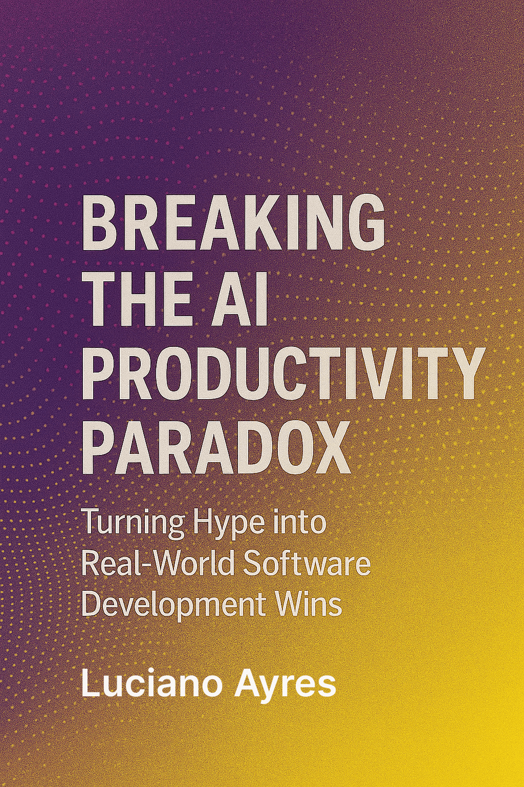

# Breaking the AI Productivity Paradox: Turning Hype into Real-World Software Development Wins

**[Breaking the AI Productivity Paradox: Turning Hype into Real-World Software Development Wins](./Breaking_the_AI_Productivity_Paradox_by_Luciano_Ayres.md)**  
_A Practical Guide for IT Leaders to Unlock Tangible Productivity with AI_

By **[Luciano Ayres](https://www.linkedin.com/in/lucianoayres/)**

**First Edition | Published May 01, 2025**  
**Version 1.0**

---

## About the Book 📖

_Breaking the AI Productivity Paradox_ explores why powerful AI tools often fail to deliver expected gains in enterprise software development—and how to overcome those obstacles.

With hands-on frameworks and practical playbooks, this book equips CTOs, VPs of Engineering, and team leads with the strategies, processes, and governance needed to:

- Understand the root causes of the AI productivity gap
- Select and integrate both “smart” IDE assistants (Copilot, CodeWhisperer) and agentic tools (Cursor AI, Windsurf)
- Cultivate a culture of adoption, trust, and continuous learning
- Align AI with SDLC phases, DevOps pipelines, and governance models
- Measure impact with balanced KPIs and calculate real ROI

Whether you’re launching a pilot or scaling across hundreds of developers, this guide helps you turn AI hype into measurable software development wins.

---

## How to Read the Book 📚

- **Markdown** (full source):  
  [Read the Book (Markdown)](./Breaking_the_AI_Productivity_Paradox_by_Luciano_Ayres.md)

- **PDF** (print-ready):  
  [Download PDF](./pdf/Breaking_the_AI_Productivity_Paradox_by_Luciano_Ayres.pdf)

- **Epub** (e-reader):  
  [Download Epub](./epub/Breaking_the_AI_Productivity_Paradox_by_Luciano_Ayres.epub)

---

## Table of Contents 📝

- [Introduction](./Breaking_the_AI_Productivity_Paradox_by_Luciano_Ayres.md#introduction)  
  The paradox, its impact on enterprises, and how this book will guide you from pilot to platform.

- [Chapter 1: The Productivity Paradox in AI Development](./Breaking_the_AI_Productivity_Paradox_by_Luciano_Ayres.md#chapter-1-the-productivity-paradox-in-ai-development)  
  Defining why AI assistants promise speed yet often underdeliver in practice.

- [Chapter 2: The New Wave of AI-Powered Development Tools](./Breaking_the_AI_Productivity_Paradox_by_Luciano_Ayres.md#chapter-2-the-new-wave-of-ai-powered-development-tools)  
  Mapping the landscape from code completion engines to agentic IDEs.

- [Chapter 3: Why Productivity Gains Aren’t Guaranteed](./Breaking_the_AI_Productivity_Paradox_by_Luciano_Ayres.md#chapter-3-why-productivity-gains-arent-guaranteed)  
  Exploring human, process, and metric pitfalls behind the paradox.

- [Chapter 4: Case Study – Navigating Initial Adoption Challenges at AlphaTech](./Breaking_the_AI_Productivity_Paradox_by_Luciano_Ayres.md#chapter-4-case-study-navigating-initial-adoption-challenges-at-alphatech)  
  How training, governance, and culture turned mixed results into a 15% velocity lift.

- [Chapter 5: Case Study – Embracing an AI Agent at BetaWorks](./Breaking_the_AI_Productivity_Paradox_by_Luciano_Ayres.md#chapter-5-case-study-embracing-an-ai-agent-at-betaworks)  
  Lessons on agentic tools (Cursor AI, Windsurf), sandboxing, and style-guide integration.

- [Chapter 6: Technical Strategies for Integrating AI into the SDLC](./Breaking_the_AI_Productivity_Paradox_by_Luciano_Ayres.md#chapter-6-technical-strategies-for-integrating-ai-into-the-sdlc)  
  Embedding AI in planning, design, coding, testing, review, and maintenance.

- [Chapter 7: Aligning AI Tools with DevOps Pipelines and Workflows](./Breaking_the_AI_Productivity_Paradox_by_Luciano_Ayres.md#chapter-7-aligning-ai-tools-with-devops-pipelines-and-workflows)  
  Seamless integration into CI/CD, code review, security scans, and compliance.

- [Chapter 8: Governance and Risk Management for AI Development Tools](./Breaking_the_AI_Productivity_Paradox_by_Luciano_Ayres.md#chapter-8-governance-and-risk-management-for-ai-development-tools)  
  Policies, training, risk assessments, and audit trails for responsible use.

- [Chapter 9: The Human Factor – Managing Change, Skills, and Team Dynamics](./Breaking_the_AI_Productivity_Paradox_by_Luciano_Ayres.md#chapter-9-the-human-factor-managing-change-skills-and-team-dynamics)  
  Addressing fear, upskilling, and evolving roles in an AI-augmented team.

- [Chapter 10: Measuring Productivity and ROI in the Age of AI](./Breaking_the_AI_Productivity_Paradox_by_Luciano_Ayres.md#chapter-10-measuring-productivity-and-roi-in-the-age-of-ai)  
  Balanced KPIs, cycle-time metrics, developer satisfaction, and ROI frameworks.

- [Chapter 11: From Pilot to Platform – Playbook for Scaling AI Adoption](./Breaking_the_AI_Productivity_Paradox_by_Luciano_Ayres.md#chapter-11-from-pilot-to-platform-playbook-for-scaling-ai-adoption)  
  Phased roll-out, maturity model, and institutionalizing best practices.

- [Chapter 12: Sustaining the Advantage and Looking Ahead](./Breaking_the_AI_Productivity_Paradox_by_Luciano_Ayres.md#chapter-12-sustaining-the-advantage-and-looking-ahead)  
  Continuous improvement, future trends, and the evolving developer role.

- [References](./Breaking_the_AI_Productivity_Paradox_by_Luciano_Ayres.md#references)  
  Curated list of studies, articles, and whitepapers cited throughout the book.

---

## Contributing & Feedback 🤝

Your insights and additions make this work stronger. If you have suggestions, corrections, or wish to contribute case studies, please:

1. Open an issue in this repository.
2. Submit a pull request with your changes.

Contributions that enrich examples, refine frameworks, or share new AI adoption experiences are highly welcome.

---

## License 📄

This work is licensed under the [Creative Commons Attribution-ShareAlike 4.0 International License](https://creativecommons.org/licenses/by-sa/4.0/).
